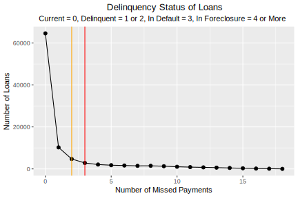

# The 2007 subprime mortgage crisis, part 1

Keywords: large database, MySQL, Python, R, data wrangling, exploratory data analysis, ordinary least squares linear regression, diagnostics

## Case Description

This is a residential mortgage credit underwriting review of 125,000 subprime mortgage loans sold in mortgage-backed securities form in 2006 by a single issuer, Washington Mutual Bank, whose assets JPMorgan Chase acquired in 2008.

No single definition of what made a loan *subprime* is universally accepted. The market, however, distinquishes subprime loans from other loans based on the cash flow features of the related mortgage backed security. In particular subprime transactions often feature a credit enhancement known as *over collateralization*, which means that the dollar volume of loans in the pool is greater than the dollar volume of securities issued, providing a cushion against loss.

Each loan has a handful of associated quantitative variables and a few dozen qualitative variables. The characteristics of the dataset help illustrate many of the challenges of data science

* Correctly classifying problems as confirmatory or observational
* Data wrangling
* Treating a problem as a predictive or classification
* Exploratory data analysis, knowing what you have to work with
* Keeping an open mind on methods
* Carefully checking the assumptions that the methods require
* Worrying over diagnostics
* Finding domain knowledge 

## Data Wrangling 

### The pool dataset

Washington Mutual sold $25 billion of subprime mortgage securities in 2006.

    +----------+-------------+
    | count(*) | sum(obal)   |
    +----------+-------------+
    |   124645 | 25542466576 |
    +----------+-------------+

During 2006, however, the pool shrank to just under 100,000 loans with an aggregate original principal balance of just over $19 billion.

    +----------+-------------+
    | count(*) | sum(obal)   |
    +----------+-------------+
    |    96271 | 19148472600 |
    +----------+-------------+
    
This diminished pool, as it existed as of the last date in early 2007 for which I had data, I will refer to as *the pool.* Here is its layout after assembly and the addition of some calculated fields. The name of the database, *dlf* stands for *delinquency, loss and foreclosure,* a business term. The table name *y7* stands for 2007 to distinguish it from the original pool *y6.* The original version was done under the MySQL open source database, and converted to MariaDB, which was created to maintain the software as open source following Oracle's acquisition of the MySQL organization.

    MariaDB [dlf]> describe y7;
    +----------+---------------+------+-----+---------+-------+
    | Field    | Type          | Null | Key | Default | Extra |
    +----------+---------------+------+-----+---------+-------+
    | city     | varchar(25)   | YES  |     | NULL    |       |
    | cltv     | decimal(10,0) | YES  |     | NULL    |       |
    | ctapeno  | decimal(10,0) | YES  |     | NULL    |       |
    | deal     | varchar(25)   | YES  |     | NULL    |       |
    | down     | int(11)       | YES  |     | NULL    |       |
    | dti      | decimal(10,0) | YES  |     | NULL    |       |
    | dtype    | varchar(25)   | YES  |     | NULL    |       |
    | ebal     | decimal(10,0) | YES  |     | NULL    |       |
    | fico     | decimal(10,0) | YES  |     | NULL    |       |
    | fpd      | date          | YES  |     | NULL    |       |
    | gainloss | decimal(10,0) | YES  |     | NULL    |       |
    | grade    | varchar(5)    | YES  |     | NULL    |       |
    | irate    | decimal(10,0) | YES  |     | NULL    |       |
    | issuer   | varchar(10)   | YES  |     | NULL    |       |
    | lat      | decimal(10,0) | YES  |     | NULL    |       |
    | lien     | int(11)       | YES  |     | NULL    |       |
    | liq      | decimal(10,0) | YES  |     | NULL    |       |
    | lng      | decimal(10,0) | YES  |     | NULL    |       |
    | lstatus  | int(11)       | YES  |     | NULL    |       |
    | ltype    | varchar(25)   | YES  |     | NULL    |       |
    | margin   | decimal(10,0) | YES  |     | NULL    |       |
    | metro    | varchar(25)   | YES  |     | NULL    |       |
    | nrate    | decimal(10,0) | YES  |     | NULL    |       |
    | obal     | decimal(10,0) | YES  |     | NULL    |       |
    | odate    | date          | YES  |     | NULL    |       |
    | oltv     | decimal(10,0) | YES  |     | NULL    |       |
    | orate    | decimal(10,0) | YES  |     | NULL    |       |
    | oterm    | int(11)       | YES  |     | NULL    |       |
    | payments | int(11)       | YES  |     | NULL    |       |
    | pmiflag  | int(11)       | YES  |     | NULL    |       |
    | pocode   | int(11)       | YES  |     | NULL    |       |
    | pod      | date          | YES  |     | NULL    |       |
    | ppp      | int(11)       | YES  |     | NULL    |       |
    | ptd      | date          | YES  |     | NULL    |       |
    | purpose  | varchar(25)   | YES  |     | NULL    |       |
    | remit    | decimal(10,0) | YES  |     | NULL    |       |
    | sbal     | decimal(10,0) | YES  |     | NULL    |       |
    | servno   | decimal(10,0) | YES  |     | NULL    |       |
    | sint     | decimal(10,0) | YES  |     | NULL    |       |
    | sprin    | decimal(10,0) | YES  |     | NULL    |       |
    | spymt    | decimal(10,0) | YES  |     | NULL    |       |
    | st       | varchar(4)    | YES  |     | NULL    |       |
    | zip      | int(11)       | YES  |     | NULL    |       |
    | otype    | varchar(25)   | YES  |     | NULL    |       |
    | rdate    | date          | YES  |     | NULL    |       |
    | ptype    | varchar(15)   | YES  |     | NULL    |       |
    | dptd     | int(7)        | YES  |     | NULL    |       |
    | dfpd     | int(7)        | YES  |     | NULL    |       |
    +----------+---------------+------+-----+---------+-------+
    48 rows in set (0.00 sec)

The field names are mostly standard abbreviations in the business, although practice varied.

As of the end of the first quarter 2007 *down* is the number of months that a loan has missed payment. A value greater than 3 generally indicates a loan in foreclosure or a loan that has been foreclosed and is in the process of being sold. However, a borrower in many jurisdictions may reinstate the loan by paying past due amounts with interest and fees.

### Creating the data set

Data came from public and semi-public sources. The loan level data at origination came from 14 HTML files. The performance data came from spreadsheets posted to a password protected website available to institutional investors, the only customers for mortgage backed securities not issued by a non-governmental sponsored issuer. I describe the reasons why the in-house systems were bypassed in [this sidenote](/assets/datasources.html).

The HTML data was easy to extract. The header and each record was tagged as preformatted

    <pre>payload</pre> 

where *payload* represents the data fields. An [example source document](https://www.sec.gov/Archives/edgar/data/1119605/000114420406002461/v033798_fwp.htm) comes from a filing with the Securities and Exchange Commission for the first transaction in 2006. This type of file was processed with a bash command line script, the separate tables imported into temporary databases that were joined on the loan number key.

One of the typical data scrubbing tasks was converting dates into ISO form -- from 3/6/2006, say, to 2006-03-06, for which I wrote a version 2 [Python script](https://gist.github.com/technocrat/d02e2c703001a9a0ba54111bdcea87b6).

The performance data was available only in spreadsheet form, by month and transaction, which  required considerable scrubbing to bring into the database. (For example, some dollar values were entered as character strings; when these problems cropped up, I wrote small bash, Perl or Python scripts.) I combined the spreadsheets into a single plaintext file to import to the database, used a supplemental zipcode lookup table to identify the metropolitan area (for possible use with the Case Shiller Index of Home Prices) and added the longitude/latitude coordinates of centroid of the Census version of the zipcode (the *ZCTA*) for possible mapping.

## Choosing the outcome measure

A mortgage payment is delinquent when a payment due on the first of the month has not been received by the first business day of the following month. (For some government sponsored programs, not included here, the convention is receipt by the last business day of the month in which due.) 

The first decision is whether to measure outcome on the number of loans or on the weighted principal balance of each loan. Investors generally look at *pool performance* in terms of the scheduled aggregate principal balance due versus the amount received each month. Because each class of investor has a different perspective depending on where it falls in the priority of payment (the *waterfall*), no single measure of balance weighted delinquency will be relevant to all investors. Therefore, I begin the analysis with the unweighted number of delinquencies.

## Defining the outcome measure

The simplest measure is the percentage of loans that are current in any given month, regardless of past payment history. For the July 1, 2007 due date, out of 96,271 loans, 87,369 were current, or approximately 90.8%. Of the remainder 4,844, approximately 5.0% were down one payment, and 3,015, approximately 3.1% were in default (three payments down) or in the process of foreclosure.

The delinquency *rate* is often defined as the percentage of loans 60 or more days delinquent, meaning that a payment due in month one was not receive in month two or three. Under that measure, the delinquency rate for the pool at July 1, 2007 was approximtely 8.1%.

A [retrospective](https://goo.gl/dwisgH) study found that the median delinquency rate for **all** subprime loans, including those originated in earlier years, to be 12.2%, with a range of 3% to 25%. The mid-year performance of the pool at mid-2007 was, accordingly, below the median.

The most complex measure of delinquency would be the pattern over a period of, say, 12 months of payment versus non-payment. A loan, for example, could be delinquent every other month but happen to be current on the measurement date. Unfortunately there are 4,096 payment patterns in a year. Also, many of the payment patterns consist of a long string of defaulted loans in foreclosure.

Other alternatives would the number of months since the last payment, whether the loan had missed two or more payments at the measurement date or three or more payments, and the percentage of payments made before entering the foreclosure process, 



## Preliminary analysis, based on FICO scores, using linear regression

### FICO's importance

In 1995, Freddie Mac advised lenders that it had found that consumer credit scores developed by Fair, Issac and Company, Inc. (**FICO** scores) strongly predicted the likelihood of default on mortgage loans. Freddie Mac's communication is reproduced as Attachment 2 in testimony before the U.S. House Committee on Oversight and Government Reform, the [Pinto testimony], beginning at page 28 of the pdf.

A traditional description of the limitations of credit scores is similar to the following:

> Third-party credit reporting organizations provide credit scores as an aid to lenders in evaluating the creditworthiness of borrowers. Although different credit reporting organizations use different methodologies, higher credit scores indicate greater creditworthiness. Credit scores do not necessarily correspond to the probability of default over the life of the related mortgage loan because they reflect past credit history, rather than an assessment of future payment performance. In addition, the credit scores shown were collected from a variety of sources over a period of weeks, months or longer, and the credit scores do not necessarily reflect the credit scores that would be reported as of the date of this prospectus supplement. Credit scores also only indicate general consumer creditworthiness, and credit scores are not intended to specifically apply to mortgage debt. Therefore, credit scores should not be considered as an accurate predictor of the likelihood of repayment of the related mortgage loans.

(From a 2002 transaction.)

The rating agencies and buyers involved in residential mortgage backed securities, however, attached considerable importance to credit scores, generically referred to as FICOs. Therefore, the FICO composition was an obvious starting point.

```{r setup4, echo = FALSE, warning=FALSE, message=FALSE}
library(tidyverse)
library(lubridate)
library(ggfortify)
library(GGally)
library(knitr)
library(kableExtra)
#### Note: The following code is surpressed in the RMD file in favor of saving the output as Rda objects for reuse
#library(DBI)
#library(RMySQL)
#drv <- dbDriver("MySQL")
#con <- dbConnect(drv, username="root", password="", dbname ="dlf", host="localhost")
#y7pop <- as.tibble(dbGetQuery(con, "SELECT deal, down, fico, dti, cltv, obal, orate, fpd, ptd, grade, purpose, dtype, ltype, otype, ptype, zip, metro FROM y7"))
#set.seed(137)
#y7train <- y7pop %>% sample_frac(0.667, replace = TRUE)
#y7test <- setdiff(y7train, y7pop)
#y7train_scaled <- y7train %>% filter(fico > 1) %>% mutate(fpd = as_date(fpd), ptd = as_date(ptd))  %>% mutate(perf = as.integer(perf(down)), fico = scale(fico)) %>% mutate(dti = scale(dti), cltv = scale(cltv)) %>% mutate(orate = scale(orate), obal = scale(obal))
#y7test_scaled <- y7test %>% filter(fico > 1) %>% mutate(fpd = as_date(fpd), ptd = as_date(ptd))  %>% mutate(perf = as.integer(perf(down)), fico = scale(fico)) %>% mutate(dti = scale(dti), cltv = scale(cltv)) %>% mutate(orate = scale(orate), obal = scale(obal))
#samtrain <- sample_frac(y7train, 0.12)
#samtest <- sample_frac(y7test, 0.12)
#samtrain_scaled <- sample_frac(y7train_scaled, 0.12)
#samtest_scaled <- sample_frac(y7test_scaled, 0.12)
#save(y7pop = "data/scrubbed/split/y7pop.Rda")
#save(y7train = "data/scrubbed/split/y7train.Rda")
#save(y7test =  "data/scrubbed/split/y7tests.Rda")
#save(y7train_scaled = "data/scrubbed/split/y7train.Rda")
#save(y7test_scaled) = "data/scrubbed/split/y7test.Rda")
#save(y7samtrain_scaled = "data/scrubbed/split/y7samtrain_scaled.Rda")
#save(y7samtest_scaled) = "data/scrubbed/split/y7samtest_scaled.Rda")
load('data/scrubbed/split/y7pop.Rda')
load('data/scrubbed/split/y7train.Rda')
load('data/scrubbed/split/y7test.Rda')
load('data/scrubbed/split/y7train_scaled.Rda')
load('data/scrubbed/split/y7test_scaled.Rda')
load('data/scrubbed/split/y7samtrain_scaled.Rda')
load('data/scrubbed/split/y7samtest_scaled.Rda')
``` 

### Performance outcome measure

*Down* is the number of missed payments as of the latest date. If a borrower misses three consequtive payments, foreclosure is triggered, which may be a relatively quick process in states that do not require a court proceeding or relatively lengthy in those that do. It is what we are trying to predict with the data at hand. It will be the dependent variable.

### FICO scores in the pool

FICO scores have a minimum value of 300, and a maximum value of 850. Foreign borrowers have a FICO score of 0. The summary statistics are:

```{r, echo = FALSE, warning=FALSE, message=FALSE}
summary(y7pop$fico)
getmode <- function(v) {
   uniqv <- unique(v)
   uniqv[which.max(tabulate(match(v, uniqv)))]
}
nofico <-  filter(y7pop, fico < 300)
lowfico <- filter(y7pop, fico < 500 & fico > 0)
```

and the mode is `r getmode(y7pop$fico)`. The pool included two loans with FICO scores of 0, indicating that they were foreign buyers.

Sixteen other loans had scores below 500:

```{r, results="asis", echo = FALSE}
kable(lowfico, format.args = list(big.mark = ","), caption = "Number of low-FICO loans by deal")  %>% kable_styling(bootstrap_options = "striped", full_width = F) 
```

The *cliffs* around 500 (below which only the small number of loans in the tables above are included), 600, 630 and 635 represent the cumulative segmentation of the pools to obtain favorable ratings. Not all deals followed this approach, however.

```{r, results="asis", echo = FALSE}
ggplot(y7pop) + geom_histogram(aes(x=fico)) + ggtitle("FICO scores for 2006 transactions in increments") + labs(x = "FICO", y = "Number of Loans") + facet_wrap(~deal)
```

The variability among transactions suggest that *if* FICO scores have an influence on default rates, it may be necessary to stratify of otherwise transform the data to obtain useful results.

### The FICO scores are not normally distributed

```{r, results="asis", echo = FALSE, warning=FALSE}
ggplot(y7pop) + aes(sample=fico) + stat_qq(distribution=qnorm) + stat_qq_line() + ylab("FICO") + labs(title = "QQ Plot of Raw FICO Scores of the Pool")
``` 

As a group, FICO scores have *fat tails,* a trait that is present in each of the deals to some degree. There are more loans with very low FICO scores than you would expect if score were randomly distributed plus more loans with high score. We also see a dip in the 500-600 range (loans that may only have been originated due to compensating factors), which are fewer than the sub-500 FICO loans.

An approximately 12% random sample with replacement of normalized scores shows a similar pattern.

```{r, results="asis", echo = FALSE, warning=FALSE}
ggplot(y7samtrain_scaled) + aes(sample=fico) + stat_qq(distribution=qnorm) + stat_qq_line() + ylab("FICO") + labs(title = "QQ Plot of Normalized FICO Scores from a 12.5% Sample of the Training Data")
```

With variations, all the deals in the sample of normalized FICO scores have similiar distributions. 

```{r, results="asis", echo = FALSE, warning=FALSE}
ggplot(y7samtrain_scaled) + aes(sample=fico) + stat_qq(distribution=qnorm) + stat_qq_line() + ylab("FICO") + labs(title = "QQ Plot of Normalized FICO Scores from 12.5% Sample of the Training Data") + facet_wrap(~ deal)
``` 

A candidate variable that is not normally distributed, even when sampled, raises a red flag. Can it be used as part of a regression model? Let's find out.

### None of the quantitative variables can be used in linear regression for the pool as a whole

```{r, results="asis", echo = TRUE, warning=FALSE}
fico_sam_mod <- lm(down ~ fico, data = y7samtrain_scaled)
library(ggfortify)
autoplot(fico_sam_mod, label.size = 3)
``` 

The diagnostic on the upper right corner shows the distribution of the residuals (differences between the data point and the best fit line) compared to the expected difference, represented by the dashed line, a normal distribution.

This eliminates *fico* as a candidate independent variable in any ordinary least square linear regression model.

We see the same problem with the debt-to-income ratio, *dti*,

```{r, results="asis", echo = FALSE, warning=FALSE}
dti_sam_mod <- lm(down ~ dti, data = y7samtrain_scaled)
autoplot(dti_sam_mod, label.size = 3)
```

combined loan-to-value ratio, *cltv*,

```{r, results="asis", echo = FALSE, warning=FALSE}
cltv_sam_mod <- lm(down ~ cltv, data = y7samtrain_scaled)
autoplot(cltv_sam_mod, label.size = 3)
```

original balance, *obal*,

```{r, results="asis", echo = FALSE, warning=FALSE}
obal_sam_mod <- lm(down ~ obal, data = y7samtrain_scaled)
autoplot(obal_sam_mod, label.size = 3)
```

original rate, *orate*,

```{r, results="asis", echo = FALSE, warning=FALSE}
orate_sam_mod <- lm(down ~ orate, data = y7samtrain_scaled)
autoplot(orate_sam_mod, label.size = 3)
```

and all the quantitative variables taken together, dipping our toes into *multiple* linear regression.

```{r, results="asis", echo = FALSE, warning=FALSE}
all_sam_mod <- lm(down ~ dti + cltv + obal + orate , data = y7samtrain_scaled)
autoplot(all_sam_mod, label.size = 3)
```

Clearly something is amiss. It's time to test whether the model assumptions are sane:

<pre>
```{r, results="asis", echo = FALSE, warning=FALSE}
library(gvlma)
gvmodel <- gvlma(lm(down ~ dti + cltv + obal + orate, data = y7samtrain_scaled))

gvmodel
``` 
</pre>

In short, a test of the model residuals highlights numerically what we can see in the diagnostic plots, that they are not normally distributed, but markedly skewed with a high kurtosis (many extreme outliers). The *Global Stats* measure provided by the **gvlma** package tests for linearity of each predictor variable, holding the others constant, that the slopes bear no interdependence and the effects of each are additive. The failure of the Link Function is just another indication of the non-normality of the residuals

Heteroscedasticity is absent, none of the residuals have different variability from the others, which is the only assumption satisfied.

Had we relied solely on the summary output of the model and failed to look at either the diagnostic plots or the output of *gvlma,* we might have fooled ourselves into thinking that we had at least accounted for a small proportion of the variance in the response variable.

<pre>
```{r, results="asis", echo = FALSE, warning=FALSE}
summary(lm(down ~ dti + cltv + obal + orate, data = y7samtrain_scaled))
``` 
</pre>

In the following sections, we will reconsider outcome measures and turn to logistic regression and use the categorical variables available in the data.
