--- 
title: "Data Science Portfolio"
author: "Richard Careaga"
date: "2018-06-28"
site: bookdown::bookdown_site
output: bookdown::gitbook
documentclass: book
github-repo: github/technocrat/technocrat.github.io
description: "Landing site"
---
# Purpose  {#preface}

This site shows where Richard Careaga's data science skills stand in mid-2018. 

Its intent is to provide prospective employers with concrete evidence of my abilities to do the work of a data sciencist. The content is all my own work, and none of the cases are based on classroom assignments, except where indicated. The style of these pages is directed to that purpose. They are not academic papers, industry conference papers, nor reports to management. They are designed to show you my thought processes and methods.

## Updates

* 2018-06-23 added qqnorm tests to FICO example in Failure Analysis chapter, part 1
* 2018-06-26 stratified Failure Analysis 125K dataset to censor loan dropouts during 2006, classified remaining loans into performance categories based on monthly payment/nonpayment data and compared FICO distributions in the categories
* 2018-06-28 illustrated non-normality of FICO distributions with Shapiro-Wilks test; refactored database for multiple regression analysis including categorical data

## Literate programming: the tight integration of code and text

An analysis can have different audiences, and one of those may be peers, who may want to look under the hood to see exactly how the data were processed to produce the results given. This book is in that style and the RMarkdown files used to produce this portfolio are all available: 

    git clone https://github.com/technocrat/technocrat.github.io

## Background

In 2007, I put much effort into acquiring the nuts-and-bolts of data science, dusting off old statistial learning, and throwing them into the front line of the initial skirmishes of the Great Recession. This was not something in my job description at Washington Mutual Bank, the largest ever to fail in the U.S. Fortunately, I was senior enough to decide on my own how best to spend my time. 

I spent a month split between data acquisition and learning three new software tools -- MySQL, R and Python. That dataset is one of several cases studies in this document that I use to show what you can expect if you take me on as a data scientist.

The cases range from spreadsheet sized (a few hundred records) to small (a thousand), middling (125,000) and largest (500,000). As the cases get larger, the number of fields grow, as well, along with the data clean-up.

## The Cases

Each of the cases is designed to illustrate one or more specific skill by presenting an example and explaining what motivated it, what it does, the tools used, and what its output accomplished.

* 2015 police involved homicides: Descriptive statistics, observational data hypothesis testing
* The cinancial cash flow model: OOP Python, model derivation from narrative
* Failure analysis of subprime Loans: MySQL,R, exploratory data analysis, high-dimensional data, covariance, clustering, regression, principa component analyis, machine learning
* The Enron email corpus: Python, NLTK, social network analysis, de-duplication, stopwords, boilerplate stripping
* Daycare costs and unexamined Assumptions: Data skepticism
* Examples of utility programming in Python, Haskell, Lua and Flex/Bison

## Current Credentials

I've completed the following online courses, to consolidate and expand my previous training and experience in data science, which sprung, ultimately, from undergraduate and graduate degrees in geology and geophysics. My plan is to use these cases to apply the many new techniques that I have learned to date, and expect to learn as I complete the remaining courses in the series.

### Graduate school level

 

### Undergraduate level

## Prior analytic and programming experience

My prior analytic education and experience was in geology/geophysics (M.S.) and law (J.D.) I have been on *nix as my own sysadm since 1984, including Venix (a v7 derivative), Irix (SGI), Ubuntu and other Linux versions, and Mac OSx. My orientation is strongly CLI, rather than GUI, but I have used Excel and Word since their early release. I have non-PC experience with the IBM S/34 and implementation of payroll, general ledger and budgeting. During the mid-90s, I installed, configured and operated http, mail, news, proxy, certificate and LDAP servers. I am familiar with many of the important bash tools (which I use on a daily basis) and with C and Perl (which I can still read, but seldom use).

> When we got our numbers off of greenbar, no one cared how pretty it looked. 

<!--chapter:end:index.Rmd-->

# 2015 Police Involved Homicides {#counted}

Keywords: Descriptive statistics, R, Census API, geocoding, thematic mapping

## Introduction

Police involved civilian homicides in the United States is the subject of a series published by *The Guardian,* [The Counted], which compiles media reports of homicides resulting from police encounters in the United States. You can explore the data interactively at their [interactive] page. The data version used in this chapter is dated 2016-06-30.

## The Data

[The Counted] information on 2015 police involved civilian homicides report that the deaths in 2015 represent 1,146 of the current population of the United States, approximately 320,000,000, a vanishingly small percentage. As a percentage of all homicides in 2014, the deaths represent approximately 6.92%. *See* [Health, United States, 2015 - Individual Charts and Tables: Spreadsheet, PDF, and PowerPoint files, Table 17].

[The Counted] data layout in in CSV (comma separated value form) is:

<table class="table table-striped" style="width: auto !important; margin-left: auto; margin-right: auto;">
<caption>(\#tab:unnamed-chunk-1)Fields in the data provided by The Guardian The Counted Project</caption>
<tbody>
  <tr>
   <td style="text-align:left;"> uid </td>
   <td style="text-align:left;"> year </td>
  </tr>
  <tr>
   <td style="text-align:left;"> name </td>
   <td style="text-align:left;"> streetaddress </td>
  </tr>
  <tr>
   <td style="text-align:left;"> age </td>
   <td style="text-align:left;"> city </td>
  </tr>
  <tr>
   <td style="text-align:left;"> gender </td>
   <td style="text-align:left;"> state </td>
  </tr>
  <tr>
   <td style="text-align:left;"> raceethnicity </td>
   <td style="text-align:left;"> classification </td>
  </tr>
  <tr>
   <td style="text-align:left;"> month </td>
   <td style="text-align:left;"> lawenforcementagency </td>
  </tr>
  <tr>
   <td style="text-align:left;"> day </td>
   <td style="text-align:left;"> armed </td>
  </tr>
</tbody>
</table>

Classification" is the cause of death and "armed" is whether or how the civilian was armed.

## Tabular summary of the data

### Gender

Approximately 95 percent of deaths were men. Gender of one death was reported as "non-conforming," possibly representing the delays involved in revising reporting systems to account for transgendered citizens.

<table class="table table-striped" style="width: auto !important; margin-left: auto; margin-right: auto;">
<caption>(\#tab:unnamed-chunk-2)Percentages deaths by gender</caption>
<tbody>
  <tr>
   <td style="text-align:left;"> Female </td>
   <td style="text-align:right;"> 4.62 </td>
  </tr>
  <tr>
   <td style="text-align:left;"> Male </td>
   <td style="text-align:right;"> 95.29 </td>
  </tr>
  <tr>
   <td style="text-align:left;"> Non-conforming </td>
   <td style="text-align:right;"> 0.09 </td>
  </tr>
</tbody>
</table>

### Race/Ethnicity

White deaths are under-represented compared to the national population. White, non-Hispanic population in 2014 was 62.2%. [Census Projections]

<table class="table table-striped" style="width: auto !important; margin-left: auto; margin-right: auto;">
<caption>(\#tab:unnamed-chunk-3)Percentage deaths by race/ethnicity</caption>
<tbody>
  <tr>
   <td style="text-align:left;"> Arab-American </td>
   <td style="text-align:right;"> 0.35 </td>
  </tr>
  <tr>
   <td style="text-align:left;"> Asian/Pacific Islander </td>
   <td style="text-align:right;"> 2.09 </td>
  </tr>
  <tr>
   <td style="text-align:left;"> Black </td>
   <td style="text-align:right;"> 26.70 </td>
  </tr>
  <tr>
   <td style="text-align:left;"> Hispanic/Latino </td>
   <td style="text-align:right;"> 17.02 </td>
  </tr>
  <tr>
   <td style="text-align:left;"> Native American </td>
   <td style="text-align:right;"> 1.13 </td>
  </tr>
  <tr>
   <td style="text-align:left;"> Other </td>
   <td style="text-align:right;"> 0.09 </td>
  </tr>
  <tr>
   <td style="text-align:left;"> Unknown </td>
   <td style="text-align:right;"> 1.92 </td>
  </tr>
  <tr>
   <td style="text-align:left;"> White </td>
   <td style="text-align:right;"> 50.70 </td>
  </tr>
</tbody>
</table>

### Age

Deaths were of all ages. The youngest death was 5 and the oldest, 85. The median age of death (half older and half younger) was 47.5, and the mean (average) age of death was approximately 47.

<table class="table table-striped" style="width: auto !important; margin-left: auto; margin-right: auto;">
<caption>(\#tab:unnamed-chunk-4)Percentage deaths by age group</caption>
<tbody>
  <tr>
   <td style="text-align:right;"> 5 </td>
   <td style="text-align:right;"> 0.09 </td>
  </tr>
  <tr>
   <td style="text-align:right;"> 15 </td>
   <td style="text-align:right;"> 5.15 </td>
  </tr>
  <tr>
   <td style="text-align:right;"> 20 </td>
   <td style="text-align:right;"> 12.91 </td>
  </tr>
  <tr>
   <td style="text-align:right;"> 25 </td>
   <td style="text-align:right;"> 16.06 </td>
  </tr>
  <tr>
   <td style="text-align:right;"> 30 </td>
   <td style="text-align:right;"> 15.45 </td>
  </tr>
  <tr>
   <td style="text-align:right;"> 35 </td>
   <td style="text-align:right;"> 12.74 </td>
  </tr>
  <tr>
   <td style="text-align:right;"> 40 </td>
   <td style="text-align:right;"> 8.38 </td>
  </tr>
  <tr>
   <td style="text-align:right;"> 45 </td>
   <td style="text-align:right;"> 9.86 </td>
  </tr>
  <tr>
   <td style="text-align:right;"> 50 </td>
   <td style="text-align:right;"> 7.33 </td>
  </tr>
  <tr>
   <td style="text-align:right;"> 55 </td>
   <td style="text-align:right;"> 5.41 </td>
  </tr>
  <tr>
   <td style="text-align:right;"> 60 </td>
   <td style="text-align:right;"> 3.58 </td>
  </tr>
  <tr>
   <td style="text-align:right;"> 65 </td>
   <td style="text-align:right;"> 1.22 </td>
  </tr>
  <tr>
   <td style="text-align:right;"> 70 </td>
   <td style="text-align:right;"> 0.61 </td>
  </tr>
  <tr>
   <td style="text-align:right;"> 75 </td>
   <td style="text-align:right;"> 0.61 </td>
  </tr>
  <tr>
   <td style="text-align:right;"> 80 </td>
   <td style="text-align:right;"> 0.09 </td>
  </tr>
  <tr>
   <td style="text-align:right;"> 85 </td>
   <td style="text-align:right;"> 0.17 </td>
  </tr>
  <tr>
   <td style="text-align:right;"> NA </td>
   <td style="text-align:right;"> 0.35 </td>
  </tr>
</tbody>
</table>

### Cause of Death

Gunshots are the leading cause of deaths in police involved civilian homicides, representing 88.92% of all deaths in [The Counted] dataset.

### Whether and how civilians were armed

Civilian firearms were the most common category involved, but unarmed civilians were the next most common, representing 48.34%  and 19.98% of all deaths, respectively.

<table class="table table-striped" style="width: auto !important; margin-left: auto; margin-right: auto;">
<caption>(\#tab:unnamed-chunk-5)Percentage deaths by whether and how civilian was armed</caption>
<tbody>
  <tr>
   <td style="text-align:left;"> Disputed </td>
   <td style="text-align:right;"> 0.35 </td>
  </tr>
  <tr>
   <td style="text-align:left;"> Firearm </td>
   <td style="text-align:right;"> 48.34 </td>
  </tr>
  <tr>
   <td style="text-align:left;"> Knife </td>
   <td style="text-align:right;"> 13.44 </td>
  </tr>
  <tr>
   <td style="text-align:left;"> No </td>
   <td style="text-align:right;"> 19.98 </td>
  </tr>
  <tr>
   <td style="text-align:left;"> Non-lethal firearm </td>
   <td style="text-align:right;"> 4.01 </td>
  </tr>
  <tr>
   <td style="text-align:left;"> Other </td>
   <td style="text-align:right;"> 5.41 </td>
  </tr>
  <tr>
   <td style="text-align:left;"> Unknown </td>
   <td style="text-align:right;"> 4.62 </td>
  </tr>
  <tr>
   <td style="text-align:left;"> Vehicle </td>
   <td style="text-align:right;"> 3.84 </td>
  </tr>
</tbody>
</table>

### Location

More deaths occurred in California than in any other state, representing 18.32% of all deaths, which is disproportionately higher than its national share of population, 12.07%. [American Fact Finder]

<table class="table table-striped" style="width: auto !important; margin-left: auto; margin-right: auto;">
<caption>(\#tab:unnamed-chunk-6)Percentage deaths by state</caption>
<tbody>
  <tr>
   <td style="text-align:left;"> AK </td>
   <td style="text-align:right;"> 0.44 </td>
  </tr>
  <tr>
   <td style="text-align:left;"> AL </td>
   <td style="text-align:right;"> 1.66 </td>
  </tr>
  <tr>
   <td style="text-align:left;"> AR </td>
   <td style="text-align:right;"> 0.44 </td>
  </tr>
  <tr>
   <td style="text-align:left;"> AZ </td>
   <td style="text-align:right;"> 3.84 </td>
  </tr>
  <tr>
   <td style="text-align:left;"> CA </td>
   <td style="text-align:right;"> 18.32 </td>
  </tr>
  <tr>
   <td style="text-align:left;"> CO </td>
   <td style="text-align:right;"> 2.79 </td>
  </tr>
  <tr>
   <td style="text-align:left;"> CT </td>
   <td style="text-align:right;"> 0.35 </td>
  </tr>
  <tr>
   <td style="text-align:left;"> DC </td>
   <td style="text-align:right;"> 0.61 </td>
  </tr>
  <tr>
   <td style="text-align:left;"> DE </td>
   <td style="text-align:right;"> 0.35 </td>
  </tr>
  <tr>
   <td style="text-align:left;"> FL </td>
   <td style="text-align:right;"> 6.20 </td>
  </tr>
  <tr>
   <td style="text-align:left;"> GA </td>
   <td style="text-align:right;"> 3.40 </td>
  </tr>
  <tr>
   <td style="text-align:left;"> HI </td>
   <td style="text-align:right;"> 0.44 </td>
  </tr>
  <tr>
   <td style="text-align:left;"> IA </td>
   <td style="text-align:right;"> 0.44 </td>
  </tr>
  <tr>
   <td style="text-align:left;"> ID </td>
   <td style="text-align:right;"> 0.70 </td>
  </tr>
  <tr>
   <td style="text-align:left;"> IL </td>
   <td style="text-align:right;"> 2.01 </td>
  </tr>
  <tr>
   <td style="text-align:left;"> IN </td>
   <td style="text-align:right;"> 1.83 </td>
  </tr>
  <tr>
   <td style="text-align:left;"> KS </td>
   <td style="text-align:right;"> 0.96 </td>
  </tr>
  <tr>
   <td style="text-align:left;"> KY </td>
   <td style="text-align:right;"> 1.66 </td>
  </tr>
  <tr>
   <td style="text-align:left;"> LA </td>
   <td style="text-align:right;"> 2.36 </td>
  </tr>
  <tr>
   <td style="text-align:left;"> MA </td>
   <td style="text-align:right;"> 0.87 </td>
  </tr>
  <tr>
   <td style="text-align:left;"> MD </td>
   <td style="text-align:right;"> 1.48 </td>
  </tr>
  <tr>
   <td style="text-align:left;"> ME </td>
   <td style="text-align:right;"> 0.17 </td>
  </tr>
  <tr>
   <td style="text-align:left;"> MI </td>
   <td style="text-align:right;"> 1.75 </td>
  </tr>
  <tr>
   <td style="text-align:left;"> MN </td>
   <td style="text-align:right;"> 1.13 </td>
  </tr>
  <tr>
   <td style="text-align:left;"> MO </td>
   <td style="text-align:right;"> 1.92 </td>
  </tr>
  <tr>
   <td style="text-align:left;"> MS </td>
   <td style="text-align:right;"> 1.05 </td>
  </tr>
  <tr>
   <td style="text-align:left;"> MT </td>
   <td style="text-align:right;"> 0.35 </td>
  </tr>
  <tr>
   <td style="text-align:left;"> NC </td>
   <td style="text-align:right;"> 2.27 </td>
  </tr>
  <tr>
   <td style="text-align:left;"> ND </td>
   <td style="text-align:right;"> 0.09 </td>
  </tr>
  <tr>
   <td style="text-align:left;"> NE </td>
   <td style="text-align:right;"> 0.79 </td>
  </tr>
  <tr>
   <td style="text-align:left;"> NH </td>
   <td style="text-align:right;"> 0.26 </td>
  </tr>
  <tr>
   <td style="text-align:left;"> NJ </td>
   <td style="text-align:right;"> 2.09 </td>
  </tr>
  <tr>
   <td style="text-align:left;"> NM </td>
   <td style="text-align:right;"> 1.83 </td>
  </tr>
  <tr>
   <td style="text-align:left;"> NV </td>
   <td style="text-align:right;"> 1.66 </td>
  </tr>
  <tr>
   <td style="text-align:left;"> NY </td>
   <td style="text-align:right;"> 2.27 </td>
  </tr>
  <tr>
   <td style="text-align:left;"> OH </td>
   <td style="text-align:right;"> 3.23 </td>
  </tr>
  <tr>
   <td style="text-align:left;"> OK </td>
   <td style="text-align:right;"> 3.23 </td>
  </tr>
  <tr>
   <td style="text-align:left;"> OR </td>
   <td style="text-align:right;"> 1.48 </td>
  </tr>
  <tr>
   <td style="text-align:left;"> PA </td>
   <td style="text-align:right;"> 2.09 </td>
  </tr>
  <tr>
   <td style="text-align:left;"> RI </td>
   <td style="text-align:right;"> 0.09 </td>
  </tr>
  <tr>
   <td style="text-align:left;"> SC </td>
   <td style="text-align:right;"> 1.83 </td>
  </tr>
  <tr>
   <td style="text-align:left;"> SD </td>
   <td style="text-align:right;"> 0.17 </td>
  </tr>
  <tr>
   <td style="text-align:left;"> TN </td>
   <td style="text-align:right;"> 1.83 </td>
  </tr>
  <tr>
   <td style="text-align:left;"> TX </td>
   <td style="text-align:right;"> 9.77 </td>
  </tr>
  <tr>
   <td style="text-align:left;"> UT </td>
   <td style="text-align:right;"> 0.87 </td>
  </tr>
  <tr>
   <td style="text-align:left;"> VA </td>
   <td style="text-align:right;"> 1.92 </td>
  </tr>
  <tr>
   <td style="text-align:left;"> VT </td>
   <td style="text-align:right;"> 0.09 </td>
  </tr>
  <tr>
   <td style="text-align:left;"> WA </td>
   <td style="text-align:right;"> 2.01 </td>
  </tr>
  <tr>
   <td style="text-align:left;"> WI </td>
   <td style="text-align:right;"> 1.05 </td>
  </tr>
  <tr>
   <td style="text-align:left;"> WV </td>
   <td style="text-align:right;"> 1.05 </td>
  </tr>
  <tr>
   <td style="text-align:left;"> WY </td>
   <td style="text-align:right;"> 0.52 </td>
  </tr>
</tbody>
</table>

### Months and Days of Death

Nationally, deaths were spread approximately evenly among months, days of the week, days of the month and phases of the moon.  *There was at least one death on 342 days of the year,* 93.7% of all days. The median number of deaths per day was 3, and the mean number of deaths was slightly larger, 3.35. On 7 days, there were 8 deaths. 

<table class="table table-striped" style="width: auto !important; margin-left: auto; margin-right: auto;">
<caption>(\#tab:unnamed-chunk-7)Dates with highest number of deaths</caption>
<tbody>
  <tr>
   <td style="text-align:left;"> 2015-03-27 </td>
   <td style="text-align:right;"> 8 </td>
  </tr>
  <tr>
   <td style="text-align:left;"> 2015-04-21 </td>
   <td style="text-align:right;"> 8 </td>
  </tr>
  <tr>
   <td style="text-align:left;"> 2015-09-21 </td>
   <td style="text-align:right;"> 8 </td>
  </tr>
  <tr>
   <td style="text-align:left;"> 2015-10-15 </td>
   <td style="text-align:right;"> 8 </td>
  </tr>
  <tr>
   <td style="text-align:left;"> 2015-10-24 </td>
   <td style="text-align:right;"> 8 </td>
  </tr>
  <tr>
   <td style="text-align:left;"> 2015-12-14 </td>
   <td style="text-align:right;"> 8 </td>
  </tr>
  <tr>
   <td style="text-align:left;"> 2015-12-21 </td>
   <td style="text-align:right;"> 8 </td>
  </tr>
</tbody>
</table>

June had the fewest deaths, 80, 6.98%,  and July had the most deaths, 124, 10.82%.

<table class="table table-striped" style="width: auto !important; margin-left: auto; margin-right: auto;">
<caption>(\#tab:unnamed-chunk-8)Percentage deaths by month</caption>
<tbody>
  <tr>
   <td style="text-align:left;"> January </td>
   <td style="text-align:right;"> 7.94 </td>
  </tr>
  <tr>
   <td style="text-align:left;"> February </td>
   <td style="text-align:right;"> 7.16 </td>
  </tr>
  <tr>
   <td style="text-align:left;"> March </td>
   <td style="text-align:right;"> 9.86 </td>
  </tr>
  <tr>
   <td style="text-align:left;"> April </td>
   <td style="text-align:right;"> 8.90 </td>
  </tr>
  <tr>
   <td style="text-align:left;"> May </td>
   <td style="text-align:right;"> 7.50 </td>
  </tr>
  <tr>
   <td style="text-align:left;"> June </td>
   <td style="text-align:right;"> 6.98 </td>
  </tr>
  <tr>
   <td style="text-align:left;"> July </td>
   <td style="text-align:right;"> 10.82 </td>
  </tr>
  <tr>
   <td style="text-align:left;"> August </td>
   <td style="text-align:right;"> 8.90 </td>
  </tr>
  <tr>
   <td style="text-align:left;"> September </td>
   <td style="text-align:right;"> 8.46 </td>
  </tr>
  <tr>
   <td style="text-align:left;"> October </td>
   <td style="text-align:right;"> 7.94 </td>
  </tr>
  <tr>
   <td style="text-align:left;"> November </td>
   <td style="text-align:right;"> 7.33 </td>
  </tr>
  <tr>
   <td style="text-align:left;"> December </td>
   <td style="text-align:right;"> 8.20 </td>
  </tr>
</tbody>
</table>

The day of the month with the fewest deaths was day 31, and the day of the month with the most deaths was day  21.

<table class="table table-striped" style="width: auto !important; margin-left: auto; margin-right: auto;">
<caption>(\#tab:unnamed-chunk-9)Percentage deaths by day of month</caption>
<tbody>
  <tr>
   <td style="text-align:right;"> 1 </td>
   <td style="text-align:right;"> 2.36 </td>
   <td style="text-align:right;"> 9 </td>
   <td style="text-align:right;"> 3.66 </td>
   <td style="text-align:right;"> 17 </td>
   <td style="text-align:right;"> 4.10 </td>
   <td style="text-align:right;"> 25 </td>
   <td style="text-align:right;"> 2.97 </td>
  </tr>
  <tr>
   <td style="text-align:right;"> 2 </td>
   <td style="text-align:right;"> 2.88 </td>
   <td style="text-align:right;"> 10 </td>
   <td style="text-align:right;"> 3.32 </td>
   <td style="text-align:right;"> 18 </td>
   <td style="text-align:right;"> 2.18 </td>
   <td style="text-align:right;"> 26 </td>
   <td style="text-align:right;"> 3.05 </td>
  </tr>
  <tr>
   <td style="text-align:right;"> 3 </td>
   <td style="text-align:right;"> 3.32 </td>
   <td style="text-align:right;"> 11 </td>
   <td style="text-align:right;"> 3.14 </td>
   <td style="text-align:right;"> 19 </td>
   <td style="text-align:right;"> 2.79 </td>
   <td style="text-align:right;"> 27 </td>
   <td style="text-align:right;"> 3.23 </td>
  </tr>
  <tr>
   <td style="text-align:right;"> 4 </td>
   <td style="text-align:right;"> 3.23 </td>
   <td style="text-align:right;"> 12 </td>
   <td style="text-align:right;"> 3.23 </td>
   <td style="text-align:right;"> 20 </td>
   <td style="text-align:right;"> 3.14 </td>
   <td style="text-align:right;"> 28 </td>
   <td style="text-align:right;"> 3.05 </td>
  </tr>
  <tr>
   <td style="text-align:right;"> 5 </td>
   <td style="text-align:right;"> 3.66 </td>
   <td style="text-align:right;"> 13 </td>
   <td style="text-align:right;"> 3.32 </td>
   <td style="text-align:right;"> 21 </td>
   <td style="text-align:right;"> 4.89 </td>
   <td style="text-align:right;"> 29 </td>
   <td style="text-align:right;"> 2.71 </td>
  </tr>
  <tr>
   <td style="text-align:right;"> 6 </td>
   <td style="text-align:right;"> 4.10 </td>
   <td style="text-align:right;"> 14 </td>
   <td style="text-align:right;"> 3.58 </td>
   <td style="text-align:right;"> 22 </td>
   <td style="text-align:right;"> 3.66 </td>
   <td style="text-align:right;"> 30 </td>
   <td style="text-align:right;"> 2.88 </td>
  </tr>
  <tr>
   <td style="text-align:right;"> 7 </td>
   <td style="text-align:right;"> 2.71 </td>
   <td style="text-align:right;"> 15 </td>
   <td style="text-align:right;"> 4.10 </td>
   <td style="text-align:right;"> 23 </td>
   <td style="text-align:right;"> 3.40 </td>
   <td style="text-align:right;"> 31 </td>
   <td style="text-align:right;"> 1.57 </td>
  </tr>
  <tr>
   <td style="text-align:right;"> 8 </td>
   <td style="text-align:right;"> 3.58 </td>
   <td style="text-align:right;"> 16 </td>
   <td style="text-align:right;"> 3.23 </td>
   <td style="text-align:right;"> 24 </td>
   <td style="text-align:right;"> 2.97 </td>
   <td style="text-align:right;"> NA </td>
   <td style="text-align:right;"> NA </td>
  </tr>
</tbody>
</table>

The day of the week with the fewest deaths was Sunday, 12.57%, and the day of the month with the most deaths was Wednesday, 15.88%.

<table class="table table-striped" style="width: auto !important; margin-left: auto; margin-right: auto;">
<caption>(\#tab:unnamed-chunk-10)Percentage deaths by day of week</caption>
<tbody>
  <tr>
   <td style="text-align:left;"> Monday </td>
   <td style="text-align:right;"> 13.96 </td>
  </tr>
  <tr>
   <td style="text-align:left;"> Tuesday </td>
   <td style="text-align:right;"> 14.92 </td>
  </tr>
  <tr>
   <td style="text-align:left;"> Wednesday </td>
   <td style="text-align:right;"> 15.88 </td>
  </tr>
  <tr>
   <td style="text-align:left;"> Thursday </td>
   <td style="text-align:right;"> 15.01 </td>
  </tr>
  <tr>
   <td style="text-align:left;"> Friday </td>
   <td style="text-align:right;"> 14.75 </td>
  </tr>
  <tr>
   <td style="text-align:left;"> Saturday </td>
   <td style="text-align:right;"> 12.91 </td>
  </tr>
  <tr>
   <td style="text-align:left;"> Sunday </td>
   <td style="text-align:right;"> 12.57 </td>
  </tr>
</tbody>
</table>

Folk wisdom attributes increased crime and other aberations to the full moon; *see [Lunacy and the Full Moon]*. However, deaths are approximately evenly distributed over the phases of the moon.

<table class="table table-striped" style="width: auto !important; margin-left: auto; margin-right: auto;">
<caption>(\#tab:unnamed-chunk-11)Percentage deaths by lunar phase</caption>
<tbody>
  <tr>
   <td style="text-align:left;"> New </td>
   <td style="text-align:right;"> 25.48 </td>
  </tr>
  <tr>
   <td style="text-align:left;"> Waxing </td>
   <td style="text-align:right;"> 24.87 </td>
  </tr>
  <tr>
   <td style="text-align:left;"> Full </td>
   <td style="text-align:right;"> 23.91 </td>
  </tr>
  <tr>
   <td style="text-align:left;"> Waning </td>
   <td style="text-align:right;"> 25.74 </td>
  </tr>
</tbody>
</table>

### Cause of Death and Civilian Armed Status

<table class="table table-striped" style="width: auto !important; margin-left: auto; margin-right: auto;">
<caption>(\#tab:unnamed-chunk-12)Cause of death and civilian armed status, part A</caption>
 <thead>
  <tr>
   <th style="text-align:left;">   </th>
   <th style="text-align:right;"> Disputed </th>
   <th style="text-align:right;"> Firearm </th>
   <th style="text-align:right;"> Knife </th>
   <th style="text-align:right;"> No </th>
  </tr>
 </thead>
<tbody>
  <tr>
   <td style="text-align:left;"> Death in custody </td>
   <td style="text-align:right;"> 0.00 </td>
   <td style="text-align:right;"> 0.09 </td>
   <td style="text-align:right;"> 0.00 </td>
   <td style="text-align:right;"> 3.66 </td>
  </tr>
  <tr>
   <td style="text-align:left;"> Gunshot </td>
   <td style="text-align:right;"> 0.35 </td>
   <td style="text-align:right;"> 48.08 </td>
   <td style="text-align:right;"> 13.35 </td>
   <td style="text-align:right;"> 9.69 </td>
  </tr>
  <tr>
   <td style="text-align:left;"> Other </td>
   <td style="text-align:right;"> 0.00 </td>
   <td style="text-align:right;"> 0.00 </td>
   <td style="text-align:right;"> 0.00 </td>
   <td style="text-align:right;"> 0.09 </td>
  </tr>
  <tr>
   <td style="text-align:left;"> Struck by vehicle </td>
   <td style="text-align:right;"> 0.00 </td>
   <td style="text-align:right;"> 0.09 </td>
   <td style="text-align:right;"> 0.00 </td>
   <td style="text-align:right;"> 2.53 </td>
  </tr>
  <tr>
   <td style="text-align:left;"> Taser </td>
   <td style="text-align:right;"> 0.00 </td>
   <td style="text-align:right;"> 0.09 </td>
   <td style="text-align:right;"> 0.09 </td>
   <td style="text-align:right;"> 4.01 </td>
  </tr>
</tbody>
</table>

<table class="table table-striped" style="width: auto !important; margin-left: auto; margin-right: auto;">
<caption>(\#tab:unnamed-chunk-13)Cause of death and civilian armed status, part B</caption>
 <thead>
  <tr>
   <th style="text-align:left;">   </th>
   <th style="text-align:right;"> Non-lethal firearm </th>
   <th style="text-align:right;"> Other </th>
   <th style="text-align:right;"> Unknown </th>
   <th style="text-align:right;"> Vehicle </th>
  </tr>
 </thead>
<tbody>
  <tr>
   <td style="text-align:left;"> Death in custody </td>
   <td style="text-align:right;"> 0.00 </td>
   <td style="text-align:right;"> 0.09 </td>
   <td style="text-align:right;"> 0.09 </td>
   <td style="text-align:right;"> 0.00 </td>
  </tr>
  <tr>
   <td style="text-align:left;"> Gunshot </td>
   <td style="text-align:right;"> 4.01 </td>
   <td style="text-align:right;"> 5.15 </td>
   <td style="text-align:right;"> 4.45 </td>
   <td style="text-align:right;"> 3.84 </td>
  </tr>
  <tr>
   <td style="text-align:left;"> Other </td>
   <td style="text-align:right;"> 0.00 </td>
   <td style="text-align:right;"> 0.00 </td>
   <td style="text-align:right;"> 0.00 </td>
   <td style="text-align:right;"> 0.00 </td>
  </tr>
  <tr>
   <td style="text-align:left;"> Struck by vehicle </td>
   <td style="text-align:right;"> 0.00 </td>
   <td style="text-align:right;"> 0.00 </td>
   <td style="text-align:right;"> 0.09 </td>
   <td style="text-align:right;"> 0.00 </td>
  </tr>
  <tr>
   <td style="text-align:left;"> Taser </td>
   <td style="text-align:right;"> 0.00 </td>
   <td style="text-align:right;"> 0.17 </td>
   <td style="text-align:right;"> 0.00 </td>
   <td style="text-align:right;"> 0.00 </td>
  </tr>
</tbody>
</table>
Of the 1,146 deaths, 53 were women, approximately 4.62%. All but 6 of those deaths were white or black.

<table class="table table-striped" style="width: auto !important; margin-left: auto; margin-right: auto;">
<caption>(\#tab:unnamed-chunk-14)Cause of death of women and civilian armed status, part A</caption>
 <thead>
  <tr>
   <th style="text-align:left;">   </th>
   <th style="text-align:right;"> Firearm </th>
   <th style="text-align:right;"> Knife </th>
   <th style="text-align:right;"> No </th>
  </tr>
 </thead>
<tbody>
  <tr>
   <td style="text-align:left;"> Death in custody </td>
   <td style="text-align:right;"> 0.00 </td>
   <td style="text-align:right;"> 0.00 </td>
   <td style="text-align:right;"> 1.89 </td>
  </tr>
  <tr>
   <td style="text-align:left;"> Gunshot </td>
   <td style="text-align:right;"> 41.51 </td>
   <td style="text-align:right;"> 20.75 </td>
   <td style="text-align:right;"> 9.43 </td>
  </tr>
  <tr>
   <td style="text-align:left;"> Struck by vehicle </td>
   <td style="text-align:right;"> 0.00 </td>
   <td style="text-align:right;"> 0.00 </td>
   <td style="text-align:right;"> 13.21 </td>
  </tr>
  <tr>
   <td style="text-align:left;"> Taser </td>
   <td style="text-align:right;"> 0.00 </td>
   <td style="text-align:right;"> 0.00 </td>
   <td style="text-align:right;"> 1.89 </td>
  </tr>
</tbody>
</table>

<table class="table table-striped" style="width: auto !important; margin-left: auto; margin-right: auto;">
<caption>(\#tab:unnamed-chunk-15)Cause of death of women and civilian armed status, part B</caption>
 <thead>
  <tr>
   <th style="text-align:left;">   </th>
   <th style="text-align:right;"> Non-lethal firearm </th>
   <th style="text-align:right;"> Unknown </th>
   <th style="text-align:right;"> Vehicle </th>
  </tr>
 </thead>
<tbody>
  <tr>
   <td style="text-align:left;"> Death in custody </td>
   <td style="text-align:right;"> 0.00 </td>
   <td style="text-align:right;"> 0.00 </td>
   <td style="text-align:right;"> 0.00 </td>
  </tr>
  <tr>
   <td style="text-align:left;"> Gunshot </td>
   <td style="text-align:right;"> 1.89 </td>
   <td style="text-align:right;"> 1.89 </td>
   <td style="text-align:right;"> 7.55 </td>
  </tr>
  <tr>
   <td style="text-align:left;"> Struck by vehicle </td>
   <td style="text-align:right;"> 0.00 </td>
   <td style="text-align:right;"> 0.00 </td>
   <td style="text-align:right;"> 0.00 </td>
  </tr>
  <tr>
   <td style="text-align:left;"> Taser </td>
   <td style="text-align:right;"> 0.00 </td>
   <td style="text-align:right;"> 0.00 </td>
   <td style="text-align:right;"> 0.00 </td>
  </tr>
</tbody>
</table>

Of the 53 deaths of women, 35, approximately 66.04% were white. Tables show percentages of deaths among white women.

<table class="table table-striped" style="width: auto !important; margin-left: auto; margin-right: auto;">
<caption>(\#tab:unnamed-chunk-16)Cause of death of white women and civilian armed status</caption>
 <thead>
  <tr>
   <th style="text-align:left;">   </th>
   <th style="text-align:right;"> Firearm </th>
   <th style="text-align:right;"> Knife </th>
   <th style="text-align:right;"> No </th>
   <th style="text-align:right;"> Non-lethal firearm </th>
  </tr>
 </thead>
<tbody>
  <tr>
   <td style="text-align:left;"> Gunshot </td>
   <td style="text-align:right;"> 51.43 </td>
   <td style="text-align:right;"> 11.43 </td>
   <td style="text-align:right;"> 8.57 </td>
   <td style="text-align:right;"> 2.86 </td>
  </tr>
  <tr>
   <td style="text-align:left;"> Struck by vehicle </td>
   <td style="text-align:right;"> 0.00 </td>
   <td style="text-align:right;"> 0.00 </td>
   <td style="text-align:right;"> 14.29 </td>
   <td style="text-align:right;"> 0.00 </td>
  </tr>
</tbody>
</table>

Of the 53 deaths of women, 12, approximately 22.64% were black. Tables show percentages of deaths among black women.

<table class="table table-striped" style="width: auto !important; margin-left: auto; margin-right: auto;">
<caption>(\#tab:unnamed-chunk-17)Cause of death of black women and civilian armed status</caption>
 <thead>
  <tr>
   <th style="text-align:left;">   </th>
   <th style="text-align:right;"> Firearm </th>
   <th style="text-align:right;"> Knife </th>
   <th style="text-align:right;"> No </th>
   <th style="text-align:right;"> Vehicle </th>
  </tr>
 </thead>
<tbody>
  <tr>
   <td style="text-align:left;"> Gunshot </td>
   <td style="text-align:right;"> 25 </td>
   <td style="text-align:right;"> 33.33 </td>
   <td style="text-align:right;"> 16.67 </td>
   <td style="text-align:right;"> 8.33 </td>
  </tr>
  <tr>
   <td style="text-align:left;"> Struck by vehicle </td>
   <td style="text-align:right;"> 0 </td>
   <td style="text-align:right;"> 0.00 </td>
   <td style="text-align:right;"> 8.33 </td>
   <td style="text-align:right;"> 0.00 </td>
  </tr>
  <tr>
   <td style="text-align:left;"> Taser </td>
   <td style="text-align:right;"> 0 </td>
   <td style="text-align:right;"> 0.00 </td>
   <td style="text-align:right;"> 8.33 </td>
   <td style="text-align:right;"> 0.00 </td>
  </tr>
</tbody>
</table>

Of the 1,146 deaths, 1,092 were men, approximately 95.29%. 

<table class="table table-striped" style="width: auto !important; margin-left: auto; margin-right: auto;">
<caption>(\#tab:unnamed-chunk-18)Cause of death of men and civilian armed status, part A</caption>
 <thead>
  <tr>
   <th style="text-align:left;">   </th>
   <th style="text-align:right;"> Disputed </th>
   <th style="text-align:right;"> Firearm </th>
   <th style="text-align:right;"> Knife </th>
   <th style="text-align:right;"> No </th>
  </tr>
 </thead>
<tbody>
  <tr>
   <td style="text-align:left;"> Death in custody </td>
   <td style="text-align:right;"> 0.00 </td>
   <td style="text-align:right;"> 0.09 </td>
   <td style="text-align:right;"> 0.00 </td>
   <td style="text-align:right;"> 3.75 </td>
  </tr>
  <tr>
   <td style="text-align:left;"> Gunshot </td>
   <td style="text-align:right;"> 0.37 </td>
   <td style="text-align:right;"> 48.44 </td>
   <td style="text-align:right;"> 13.00 </td>
   <td style="text-align:right;"> 9.62 </td>
  </tr>
  <tr>
   <td style="text-align:left;"> Other </td>
   <td style="text-align:right;"> 0.00 </td>
   <td style="text-align:right;"> 0.00 </td>
   <td style="text-align:right;"> 0.00 </td>
   <td style="text-align:right;"> 0.09 </td>
  </tr>
  <tr>
   <td style="text-align:left;"> Struck by vehicle </td>
   <td style="text-align:right;"> 0.00 </td>
   <td style="text-align:right;"> 0.09 </td>
   <td style="text-align:right;"> 0.00 </td>
   <td style="text-align:right;"> 2.01 </td>
  </tr>
  <tr>
   <td style="text-align:left;"> Taser </td>
   <td style="text-align:right;"> 0.00 </td>
   <td style="text-align:right;"> 0.09 </td>
   <td style="text-align:right;"> 0.09 </td>
   <td style="text-align:right;"> 4.12 </td>
  </tr>
</tbody>
</table>

<table class="table table-striped" style="width: auto !important; margin-left: auto; margin-right: auto;">
<caption>(\#tab:unnamed-chunk-19)Cause of death of men and civilian armed status, part B</caption>
 <thead>
  <tr>
   <th style="text-align:left;">   </th>
   <th style="text-align:right;"> Non-lethal firearm </th>
   <th style="text-align:right;"> Other </th>
   <th style="text-align:right;"> Unknown </th>
   <th style="text-align:right;"> Vehicle </th>
  </tr>
 </thead>
<tbody>
  <tr>
   <td style="text-align:left;"> Death in custody </td>
   <td style="text-align:right;"> 0.00 </td>
   <td style="text-align:right;"> 0.09 </td>
   <td style="text-align:right;"> 0.09 </td>
   <td style="text-align:right;"> 0.00 </td>
  </tr>
  <tr>
   <td style="text-align:left;"> Gunshot </td>
   <td style="text-align:right;"> 4.12 </td>
   <td style="text-align:right;"> 5.40 </td>
   <td style="text-align:right;"> 4.58 </td>
   <td style="text-align:right;"> 3.66 </td>
  </tr>
  <tr>
   <td style="text-align:left;"> Other </td>
   <td style="text-align:right;"> 0.00 </td>
   <td style="text-align:right;"> 0.00 </td>
   <td style="text-align:right;"> 0.00 </td>
   <td style="text-align:right;"> 0.00 </td>
  </tr>
  <tr>
   <td style="text-align:left;"> Struck by vehicle </td>
   <td style="text-align:right;"> 0.00 </td>
   <td style="text-align:right;"> 0.00 </td>
   <td style="text-align:right;"> 0.09 </td>
   <td style="text-align:right;"> 0.00 </td>
  </tr>
  <tr>
   <td style="text-align:left;"> Taser </td>
   <td style="text-align:right;"> 0.00 </td>
   <td style="text-align:right;"> 0.18 </td>
   <td style="text-align:right;"> 0.00 </td>
   <td style="text-align:right;"> 0.00 </td>
  </tr>
</tbody>
</table>

Of the 1,092 deaths of men, 546, approximately 50%, were white. Tables show percentages of deaths among white men.

<table class="table table-striped" style="width: auto !important; margin-left: auto; margin-right: auto;">
<caption>(\#tab:unnamed-chunk-20)Cause of death of white men and civilian armed status, part A</caption>
 <thead>
  <tr>
   <th style="text-align:left;">   </th>
   <th style="text-align:right;"> Disputed </th>
   <th style="text-align:right;"> Firearm </th>
   <th style="text-align:right;"> Knife </th>
   <th style="text-align:right;"> No </th>
  </tr>
 </thead>
<tbody>
  <tr>
   <td style="text-align:left;"> Death in custody </td>
   <td style="text-align:right;"> 0.00 </td>
   <td style="text-align:right;"> 0.00 </td>
   <td style="text-align:right;"> 0.0 </td>
   <td style="text-align:right;"> 2.75 </td>
  </tr>
  <tr>
   <td style="text-align:left;"> Gunshot </td>
   <td style="text-align:right;"> 0.18 </td>
   <td style="text-align:right;"> 52.75 </td>
   <td style="text-align:right;"> 11.9 </td>
   <td style="text-align:right;"> 8.06 </td>
  </tr>
  <tr>
   <td style="text-align:left;"> Struck by vehicle </td>
   <td style="text-align:right;"> 0.00 </td>
   <td style="text-align:right;"> 0.00 </td>
   <td style="text-align:right;"> 0.0 </td>
   <td style="text-align:right;"> 2.75 </td>
  </tr>
  <tr>
   <td style="text-align:left;"> Taser </td>
   <td style="text-align:right;"> 0.00 </td>
   <td style="text-align:right;"> 0.00 </td>
   <td style="text-align:right;"> 0.0 </td>
   <td style="text-align:right;"> 3.85 </td>
  </tr>
</tbody>
</table>

<table class="table table-striped" style="width: auto !important; margin-left: auto; margin-right: auto;">
<caption>(\#tab:unnamed-chunk-21)Cause of death of white men and civilian armed status, part B</caption>
 <thead>
  <tr>
   <th style="text-align:left;">   </th>
   <th style="text-align:right;"> Non-lethal firearm </th>
   <th style="text-align:right;"> Other </th>
   <th style="text-align:right;"> Unknown </th>
  </tr>
 </thead>
<tbody>
  <tr>
   <td style="text-align:left;"> Death in custody </td>
   <td style="text-align:right;"> 0.00 </td>
   <td style="text-align:right;"> 0.00 </td>
   <td style="text-align:right;"> 0.00 </td>
  </tr>
  <tr>
   <td style="text-align:left;"> Gunshot </td>
   <td style="text-align:right;"> 4.76 </td>
   <td style="text-align:right;"> 4.95 </td>
   <td style="text-align:right;"> 4.95 </td>
  </tr>
  <tr>
   <td style="text-align:left;"> Struck by vehicle </td>
   <td style="text-align:right;"> 0.00 </td>
   <td style="text-align:right;"> 0.00 </td>
   <td style="text-align:right;"> 0.00 </td>
  </tr>
  <tr>
   <td style="text-align:left;"> Taser </td>
   <td style="text-align:right;"> 0.00 </td>
   <td style="text-align:right;"> 0.00 </td>
   <td style="text-align:right;"> 0.00 </td>
  </tr>
</tbody>
</table>

Of the 1,092 deaths of men, 294, approximately 26.92%, were black. Tables show percentages of deaths among black men.

<table class="table table-striped" style="width: auto !important; margin-left: auto; margin-right: auto;">
<caption>(\#tab:unnamed-chunk-22)Cause of death of black men and civilian armed status, part A</caption>
 <thead>
  <tr>
   <th style="text-align:left;">   </th>
   <th style="text-align:right;"> Disputed </th>
   <th style="text-align:right;"> Firearm </th>
   <th style="text-align:right;"> Knife </th>
   <th style="text-align:right;"> No </th>
  </tr>
 </thead>
<tbody>
  <tr>
   <td style="text-align:left;"> Death in custody </td>
   <td style="text-align:right;"> 0.00 </td>
   <td style="text-align:right;"> 0.34 </td>
   <td style="text-align:right;"> 0.00 </td>
   <td style="text-align:right;"> 5.44 </td>
  </tr>
  <tr>
   <td style="text-align:left;"> Gunshot </td>
   <td style="text-align:right;"> 0.68 </td>
   <td style="text-align:right;"> 45.24 </td>
   <td style="text-align:right;"> 11.22 </td>
   <td style="text-align:right;"> 12.93 </td>
  </tr>
  <tr>
   <td style="text-align:left;"> Other </td>
   <td style="text-align:right;"> 0.00 </td>
   <td style="text-align:right;"> 0.00 </td>
   <td style="text-align:right;"> 0.00 </td>
   <td style="text-align:right;"> 0.34 </td>
  </tr>
  <tr>
   <td style="text-align:left;"> Struck by vehicle </td>
   <td style="text-align:right;"> 0.00 </td>
   <td style="text-align:right;"> 0.34 </td>
   <td style="text-align:right;"> 0.00 </td>
   <td style="text-align:right;"> 1.36 </td>
  </tr>
  <tr>
   <td style="text-align:left;"> Taser </td>
   <td style="text-align:right;"> 0.00 </td>
   <td style="text-align:right;"> 0.34 </td>
   <td style="text-align:right;"> 0.34 </td>
   <td style="text-align:right;"> 5.44 </td>
  </tr>
</tbody>
</table>

<table class="table table-striped" style="width: auto !important; margin-left: auto; margin-right: auto;">
<caption>(\#tab:unnamed-chunk-23)Cause of death of black men and civilian armed status, part B</caption>
 <thead>
  <tr>
   <th style="text-align:left;">   </th>
   <th style="text-align:right;"> Non-lethal firearm </th>
   <th style="text-align:right;"> Other </th>
   <th style="text-align:right;"> Unknown </th>
   <th style="text-align:right;"> Vehicle </th>
  </tr>
 </thead>
<tbody>
  <tr>
   <td style="text-align:left;"> Death in custody </td>
   <td style="text-align:right;"> 0.00 </td>
   <td style="text-align:right;"> 0.34 </td>
   <td style="text-align:right;"> 0.34 </td>
   <td style="text-align:right;"> 0.00 </td>
  </tr>
  <tr>
   <td style="text-align:left;"> Gunshot </td>
   <td style="text-align:right;"> 2.72 </td>
   <td style="text-align:right;"> 4.08 </td>
   <td style="text-align:right;"> 2.72 </td>
   <td style="text-align:right;"> 5.44 </td>
  </tr>
  <tr>
   <td style="text-align:left;"> Other </td>
   <td style="text-align:right;"> 0.00 </td>
   <td style="text-align:right;"> 0.00 </td>
   <td style="text-align:right;"> 0.00 </td>
   <td style="text-align:right;"> 0.00 </td>
  </tr>
  <tr>
   <td style="text-align:left;"> Struck by vehicle </td>
   <td style="text-align:right;"> 0.00 </td>
   <td style="text-align:right;"> 0.00 </td>
   <td style="text-align:right;"> 0.34 </td>
   <td style="text-align:right;"> 0.00 </td>
  </tr>
  <tr>
   <td style="text-align:left;"> Taser </td>
   <td style="text-align:right;"> 0.00 </td>
   <td style="text-align:right;"> 0.00 </td>
   <td style="text-align:right;"> 0.00 </td>
   <td style="text-align:right;"> 0.00 </td>
  </tr>
</tbody>
</table>

Of the 1,092 deaths of men, 191, approximately 17.49%, were hispanic. Tables show percentages of deaths among hispanic men.

<table class="table table-striped" style="width: auto !important; margin-left: auto; margin-right: auto;">
<caption>(\#tab:unnamed-chunk-24)Cause of death of hispanic men and civilian armed status, part A</caption>
 <thead>
  <tr>
   <th style="text-align:left;">   </th>
   <th style="text-align:right;"> Disputed </th>
   <th style="text-align:right;"> Firearm </th>
   <th style="text-align:right;"> Knife </th>
   <th style="text-align:right;"> No </th>
  </tr>
 </thead>
<tbody>
  <tr>
   <td style="text-align:left;"> Death in custody </td>
   <td style="text-align:right;"> 0.00 </td>
   <td style="text-align:right;"> 0.00 </td>
   <td style="text-align:right;"> 0.00 </td>
   <td style="text-align:right;"> 2.62 </td>
  </tr>
  <tr>
   <td style="text-align:left;"> Gunshot </td>
   <td style="text-align:right;"> 0.52 </td>
   <td style="text-align:right;"> 43.46 </td>
   <td style="text-align:right;"> 16.75 </td>
   <td style="text-align:right;"> 10.47 </td>
  </tr>
  <tr>
   <td style="text-align:left;"> Struck by vehicle </td>
   <td style="text-align:right;"> 0.00 </td>
   <td style="text-align:right;"> 0.00 </td>
   <td style="text-align:right;"> 0.00 </td>
   <td style="text-align:right;"> 1.57 </td>
  </tr>
  <tr>
   <td style="text-align:left;"> Taser </td>
   <td style="text-align:right;"> 0.00 </td>
   <td style="text-align:right;"> 0.00 </td>
   <td style="text-align:right;"> 0.00 </td>
   <td style="text-align:right;"> 3.14 </td>
  </tr>
</tbody>
</table>

<table class="table table-striped" style="width: auto !important; margin-left: auto; margin-right: auto;">
<caption>(\#tab:unnamed-chunk-25)Cause of death of black men and civilian armed status, part B</caption>
 <thead>
  <tr>
   <th style="text-align:left;">   </th>
   <th style="text-align:right;"> Non-lethal firearm </th>
   <th style="text-align:right;"> Other </th>
   <th style="text-align:right;"> Unknown </th>
   <th style="text-align:right;"> Vehicle </th>
  </tr>
 </thead>
<tbody>
  <tr>
   <td style="text-align:left;"> Death in custody </td>
   <td style="text-align:right;"> 0.00 </td>
   <td style="text-align:right;"> 0.00 </td>
   <td style="text-align:right;"> 0.00 </td>
   <td style="text-align:right;"> 0.00 </td>
  </tr>
  <tr>
   <td style="text-align:left;"> Gunshot </td>
   <td style="text-align:right;"> 4.71 </td>
   <td style="text-align:right;"> 7.85 </td>
   <td style="text-align:right;"> 5.24 </td>
   <td style="text-align:right;"> 3.14 </td>
  </tr>
  <tr>
   <td style="text-align:left;"> Struck by vehicle </td>
   <td style="text-align:right;"> 0.00 </td>
   <td style="text-align:right;"> 0.00 </td>
   <td style="text-align:right;"> 0.00 </td>
   <td style="text-align:right;"> 0.00 </td>
  </tr>
  <tr>
   <td style="text-align:left;"> Taser </td>
   <td style="text-align:right;"> 0.00 </td>
   <td style="text-align:right;"> 0.52 </td>
   <td style="text-align:right;"> 0.00 </td>
   <td style="text-align:right;"> 0.00 </td>
  </tr>
</tbody>
</table>

## Geographic Analysis of the Data

One way to look at the data geograhically is to map the number of deaths by state. We tabulated percentages of deaths occurring by state. We can also show the *numbers*.

<table class="table table-striped" style="width: auto !important; margin-left: auto; margin-right: auto;">
<caption>(\#tab:unnamed-chunk-26)Number deaths by state</caption>
 <thead>
  <tr>
   <th style="text-align:left;"> id </th>
   <th style="text-align:right;"> n </th>
  </tr>
 </thead>
<tbody>
  <tr>
   <td style="text-align:left;"> AK </td>
   <td style="text-align:right;"> 5 </td>
  </tr>
  <tr>
   <td style="text-align:left;"> AL </td>
   <td style="text-align:right;"> 19 </td>
  </tr>
  <tr>
   <td style="text-align:left;"> AR </td>
   <td style="text-align:right;"> 5 </td>
  </tr>
  <tr>
   <td style="text-align:left;"> AZ </td>
   <td style="text-align:right;"> 44 </td>
  </tr>
  <tr>
   <td style="text-align:left;"> CA </td>
   <td style="text-align:right;"> 210 </td>
  </tr>
  <tr>
   <td style="text-align:left;"> CO </td>
   <td style="text-align:right;"> 32 </td>
  </tr>
  <tr>
   <td style="text-align:left;"> CT </td>
   <td style="text-align:right;"> 4 </td>
  </tr>
  <tr>
   <td style="text-align:left;"> DC </td>
   <td style="text-align:right;"> 7 </td>
  </tr>
  <tr>
   <td style="text-align:left;"> DE </td>
   <td style="text-align:right;"> 4 </td>
  </tr>
  <tr>
   <td style="text-align:left;"> FL </td>
   <td style="text-align:right;"> 71 </td>
  </tr>
  <tr>
   <td style="text-align:left;"> GA </td>
   <td style="text-align:right;"> 39 </td>
  </tr>
  <tr>
   <td style="text-align:left;"> HI </td>
   <td style="text-align:right;"> 5 </td>
  </tr>
  <tr>
   <td style="text-align:left;"> IA </td>
   <td style="text-align:right;"> 5 </td>
  </tr>
  <tr>
   <td style="text-align:left;"> ID </td>
   <td style="text-align:right;"> 8 </td>
  </tr>
  <tr>
   <td style="text-align:left;"> IL </td>
   <td style="text-align:right;"> 23 </td>
  </tr>
  <tr>
   <td style="text-align:left;"> IN </td>
   <td style="text-align:right;"> 21 </td>
  </tr>
  <tr>
   <td style="text-align:left;"> KS </td>
   <td style="text-align:right;"> 11 </td>
  </tr>
  <tr>
   <td style="text-align:left;"> KY </td>
   <td style="text-align:right;"> 19 </td>
  </tr>
  <tr>
   <td style="text-align:left;"> LA </td>
   <td style="text-align:right;"> 27 </td>
  </tr>
  <tr>
   <td style="text-align:left;"> MA </td>
   <td style="text-align:right;"> 10 </td>
  </tr>
  <tr>
   <td style="text-align:left;"> MD </td>
   <td style="text-align:right;"> 17 </td>
  </tr>
  <tr>
   <td style="text-align:left;"> ME </td>
   <td style="text-align:right;"> 2 </td>
  </tr>
  <tr>
   <td style="text-align:left;"> MI </td>
   <td style="text-align:right;"> 20 </td>
  </tr>
  <tr>
   <td style="text-align:left;"> MN </td>
   <td style="text-align:right;"> 13 </td>
  </tr>
  <tr>
   <td style="text-align:left;"> MO </td>
   <td style="text-align:right;"> 22 </td>
  </tr>
  <tr>
   <td style="text-align:left;"> MS </td>
   <td style="text-align:right;"> 12 </td>
  </tr>
  <tr>
   <td style="text-align:left;"> MT </td>
   <td style="text-align:right;"> 4 </td>
  </tr>
  <tr>
   <td style="text-align:left;"> NC </td>
   <td style="text-align:right;"> 26 </td>
  </tr>
  <tr>
   <td style="text-align:left;"> ND </td>
   <td style="text-align:right;"> 1 </td>
  </tr>
  <tr>
   <td style="text-align:left;"> NE </td>
   <td style="text-align:right;"> 9 </td>
  </tr>
  <tr>
   <td style="text-align:left;"> NH </td>
   <td style="text-align:right;"> 3 </td>
  </tr>
  <tr>
   <td style="text-align:left;"> NJ </td>
   <td style="text-align:right;"> 24 </td>
  </tr>
  <tr>
   <td style="text-align:left;"> NM </td>
   <td style="text-align:right;"> 21 </td>
  </tr>
  <tr>
   <td style="text-align:left;"> NV </td>
   <td style="text-align:right;"> 19 </td>
  </tr>
  <tr>
   <td style="text-align:left;"> NY </td>
   <td style="text-align:right;"> 26 </td>
  </tr>
  <tr>
   <td style="text-align:left;"> OH </td>
   <td style="text-align:right;"> 37 </td>
  </tr>
  <tr>
   <td style="text-align:left;"> OK </td>
   <td style="text-align:right;"> 37 </td>
  </tr>
  <tr>
   <td style="text-align:left;"> OR </td>
   <td style="text-align:right;"> 17 </td>
  </tr>
  <tr>
   <td style="text-align:left;"> PA </td>
   <td style="text-align:right;"> 24 </td>
  </tr>
  <tr>
   <td style="text-align:left;"> RI </td>
   <td style="text-align:right;"> 1 </td>
  </tr>
  <tr>
   <td style="text-align:left;"> SC </td>
   <td style="text-align:right;"> 21 </td>
  </tr>
  <tr>
   <td style="text-align:left;"> SD </td>
   <td style="text-align:right;"> 2 </td>
  </tr>
  <tr>
   <td style="text-align:left;"> TN </td>
   <td style="text-align:right;"> 21 </td>
  </tr>
  <tr>
   <td style="text-align:left;"> TX </td>
   <td style="text-align:right;"> 112 </td>
  </tr>
  <tr>
   <td style="text-align:left;"> UT </td>
   <td style="text-align:right;"> 10 </td>
  </tr>
  <tr>
   <td style="text-align:left;"> VA </td>
   <td style="text-align:right;"> 22 </td>
  </tr>
  <tr>
   <td style="text-align:left;"> VT </td>
   <td style="text-align:right;"> 1 </td>
  </tr>
  <tr>
   <td style="text-align:left;"> WA </td>
   <td style="text-align:right;"> 23 </td>
  </tr>
  <tr>
   <td style="text-align:left;"> WI </td>
   <td style="text-align:right;"> 12 </td>
  </tr>
  <tr>
   <td style="text-align:left;"> WV </td>
   <td style="text-align:right;"> 12 </td>
  </tr>
  <tr>
   <td style="text-align:left;"> WY </td>
   <td style="text-align:right;"> 6 </td>
  </tr>
</tbody>
</table>

### Many Datasets are Distributed Similarly to Population

Counts of some features often parallel counts of population. As a result, a map that shows the raw counts may be difficult to distinguish from a map of population. For example

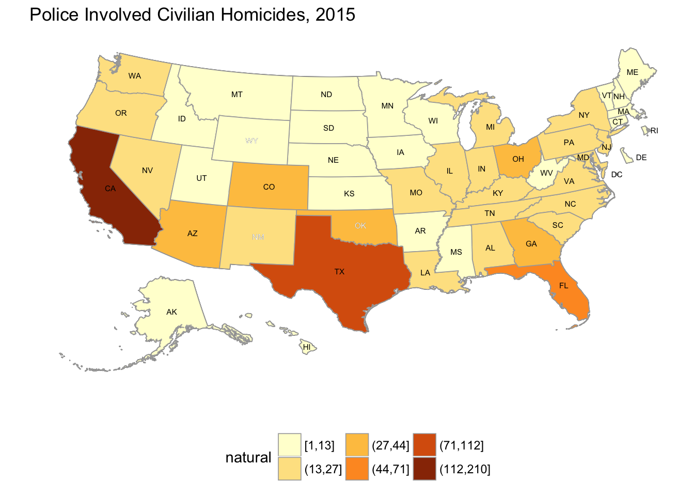

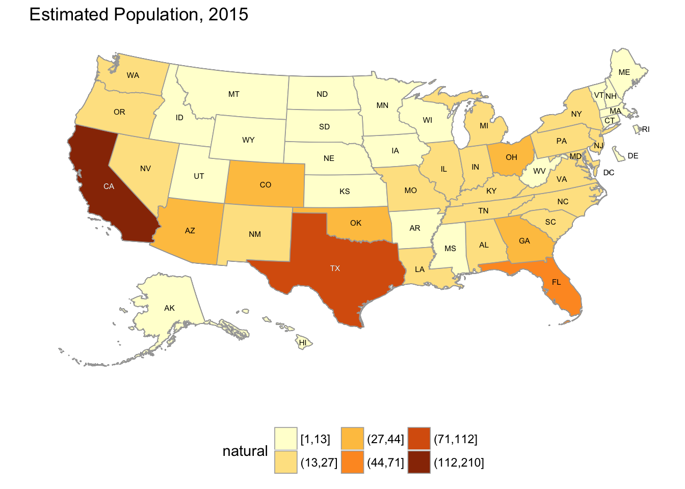

Comparing the two maps above, police involved civilian homicides are approximately proportional to state population. Some states, such as New York, have fewer police involved civilian homicides than would be expected based only on population, while other states, such as Oklahoma, have more. However, the ratios of police involved civilian homicides per hundred thousand population is a much different picture, showing strong regional differences.

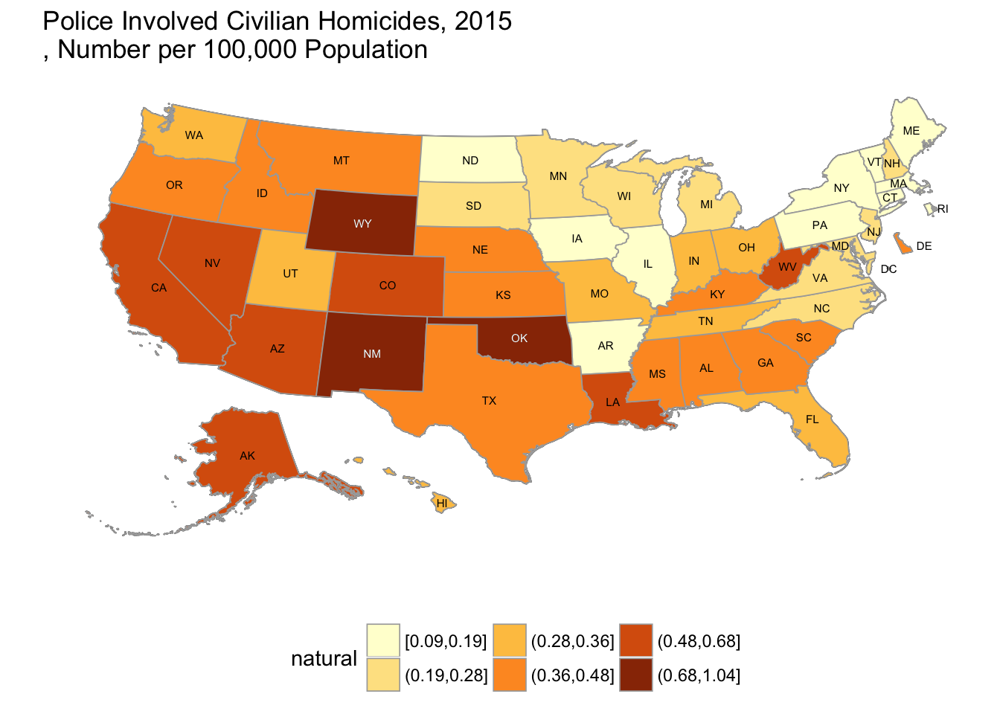

In general, states west of the Mississippi River have higher rates of police involved civilian homicides. North Dakota's low rate is an exception in the West, while Louisiana and West Virigia have higher rates than the other states in the East.

## What conclusions can we draw from the short, national summary?

Before attempting an answer, it would be well to remember that the United States is composed of 50 states and the District of Columbia, many of which has hundreds or thousands of separate law enforement agencies that operate in communities that range in diversity from little at all to very diverse in terms of national origin, ethnicity, duration of residence and that may have relatively high or relatively low unemployment and relatively different perspectives on law enforcement. 

### Detail underlying deaths of women

In short, these data are best to pose questions, rather than to provide answers. For example 13.21% of deaths of women involved situations in which the woman was unarmed and struck by a vehicle.

* [Hue Dang]
* [Nuwnah Laroche]
* [Barbara Ramey]
* [Kimberly Bedford]
* [Kylie Lindsey]
* [Isabella Chinchilla]
* [Bendetta 'Lynn' Miller]

In reviewing the related news reports, these deaths were accidental in nature (striking pedestrian in intersection, striking pedestrians walking on highway, for example). In the case of [Kimberly Bedford], the officer was convicted of a serious traffic offense for hitting a pedestrian while speeding without lights or siren. Thus, although the relative proportion, 13.21%, of unarmed women struck by vehicles is notable, these deaths are quite unlike deaths inflicted by gunshot on unarmed civilians. Without the addition of facts in addition to those from from news accounts, the 13.21% figure, by itself, is misleading.

For another example, 4.36% of all deaths were caused by Tasers. Among women, however, only 1.89% were due to Tasers. Yet, among white women 0% of deaths were due to Tasers while 8.33% of deaths of black women were Taser inflicted. That was the death of [Natasha McKenna], who was a mentally ill, 5'4" tall, 180-pound woman in handcuffs and leg shackles. Six deputies were attempting to transfer her from a jail cell and administered 4 Taser shocks that proved fatal. [The coroner]) ruled the death accidental. [A comprehensive report] details the circumstances involved in the administration of the Taser shocks and the difficulties in physically controlling the prisoner that led to the decisions to administer each of them.

Among all women, a single case of death in custody was reported, an hispanic woman who died from lack of timely medical attention after complaining of feeling unwell. The outside contractor providing medical services decided to delay services until the regularly scheduled evening rounds. Lobato died shortly after the start of rounds before being seen.

The deaths of two women, one, [Natasha McKenna,] and the other, [Jennifer Lobato], are similar in that they were both related to medical treatment in custody (one was being attempted to be transferred to a medical facility; the other died waiting medical attention).

Percentages of deaths of white and black women killed by police gunshot while in vehicles are comparable.

* [Alice Brown]
* [Mya Hall]
* [Karen Janks]
* [Christie Cathers]

All of the cases of deaths of women in vehicles by police gunshot involved situations in which the drivers were endangering the lives of civilians or officers.

In the one case of a woman, [Candace Blakley], classified as "unknown" as to whether she was armed, the cause of death was the unintentional discharge of a rifle by her husband, an officer, off duty at home. The officer was charged with involuntary manslaughter.

There was one case of a woman, [Shelly Lynn Haendiges], who died by police gunshot when she pointed a pellet gun at him in the course of an armed robbery. The [prosecutor] did not charge the officer; one of the factors appeared to be that the pellet gun closely resembled an actual semi-automatic pistol. The [family] supported the officer's action, and attributed the death to their family member's mental illness.

All other causes of deaths of women involve gunshots in situations in which the women were either armed with firearms or knives or were unarmed. Percentages of white women armed with firearms were approximately twice those of black women; percentages of black women armed with knives were approximately three times those of white women. The percentages of unarmed white and black women killed by gunshot are comparable.

In deaths involving civilians armed with knives:

* [Kristiana Coignard]
* [Tiffany Terry]
* [Janisha Fonville]
* [Jessica Uribe]
* [Monique Deckard]
* [Meagan Hockaday]
* [Nikki Burtsfield]
* [Redel Jones]
* [Norma Guzman]
* [Phyllis Jepsen]
* [Siolosega Velega-Nuufolau]

each involved situations in which the civilian threatened the officer with a knife; many of these civilians were afflicted with mental illnesses or under the influence of various substances.

The largest category of deaths of women involved death by police gunshot was in situations in which the woman was armed with a firearm.

* [Yuvette Henderson]
* [Betty Sexton]
* [Crystal Miley]
* [Stephanie Hill]
* [Kaylene Stone]
* [Deanne Choate]
* [Alexia Christian]
* [Cassandra Bolin]
* [Wendy Chappell]
* [Tamala Satre]
* [Tina Money]
* [Margaret Wagner]
* [Michelle Burg]
* [Linda Lush]
* [Marquesha McMillan]
* [Laura Lemieux]
* [Somer Speer]
* [Tashfeen Malik]
* [Sheilah Huck]
* [Shirley Weis]
* [Brenda Kimberling]
* [Erica Lauro]

The circumstances surrounding these deaths range from exchange of gunfire with a mass shooter, to armed robberies to civilians suffering mental disorders, under the influence of alcohol or other drugs and other situations involving civilians armed with firearms whose actions threatened police or bystanders.

Among women, this leaves police involved homicides by gunshot in which the civilian was unarmed. Three of the women were white and two were black.

* [Autumn Steele]
* [Christina Prestianni]
* [Tamara Seidle]
* [India Kager]
* [Bettie Jones]

Of these five deaths, two involved off-duty officers killing their girlfriend and wife, respectively; one death occurred when the driver was accidentially shot during a gun fight between her passenger and police; and one death occurred when a woman was accidentally shot as police shot at a young man holding a baseball bat in circumstances when opening the door to the victim's residence. The remaining death was also accidental. It involved a domestic dispute in the couple's front yard. The officer was talking to the husband. The wife,[Autumn Steele], and a large dog ran out of the house. The dog knocked over the officer. Neither owner restrained the dog. The officer shot to protect himself from the dog and hit the wife by accident. 

In the only case involving a "non-conforming" civilian [Jesse or Jessie Herandez], police killed the transgender driver of a car moving toward an officer in an attempt to avoid an investigation. The department, as a result, changed its policy to declassify vehicles as deadly weapons justifying the response of deadly force in most cases.

Most of the police involved civilian homicides involving deaths of women were of white or black women. Based on her Samoan given and surname, one woman, [Siolosega Velega-Nuufolau], should be classified as "Asian/Pacific Islander" and another, [Tashfeen Malik], should be classified as "Arab-American," as a Pakistani-born person.)

The review of the relatively few deaths of women illustrate the hazards inherent in observational data consisting only of a single outcome under a variety of circumstances at different times and places involving different types of law enforcement agencies and situations. 

Because this is an **observational** study, it will not be possible to state the *causes* of police involved homicides, only look for associated statistical factors.

### Cautionary Example

For a relatively small dataset, the 53 deaths of women represent a large variety of circumstances. It's a classic problem in analysis, which is trying to put too many pigeons into too few pigeon holes.

## Next steps

As I update this work, I will be looking at two broad areas.

### Finer geographic detail

The state level is not the right geographic unit for comparative analysis. Fortunately, [The Counted] provided sufficient location information to geocode the data. This will enable me to analyze data by the demographic characteristics at the Congressional District level. The advantage is that those units are roughly equal in population (ranging between around 800,000 and 1,000,000).

### Testing hypotheses

At the Congressional District level, are police involved homicides randomly distributed among the population? Which demographic variables or combination of variables are associated with the deaths. Are statistics on arrest data (police/civilian encounters with non-lethal outcomes) available and do they provide a basis to construct a predictive model?

[A comprehensive report]: http://www.fairfaxcounty.gov/news/2015/report_of_investigation_of_in-custody_death.pdf
[Alexia Christian]: http://www.clatl.com/news/article/13082907/what-happened-in-the-death-of-alexia-christian
[Alice Brown]: http://www.sfgate.com/news/article/Driver-killed-by-S-F-police-identified-as-6142564.php
[American Fact Finder]: http://factfinder.census.gov/faces/tableservices/jsf/pages/productview.xhtml?src=bkmk
[Autumn Steele]: http://www.desmoinesregister.com/story/news/crime-and-courts/2015/03/24/burlington-police-fatal-shooting-body-cameras/70373048/
[Barbara Ramey]: http://www.whsv.com/home/headlines/State-Trooper-Involved-in-Luray-Crash-304924801.html
[Bendetta 'Lynn' Miller]: http://www.pennlive.com/midstate/index.ssf/2015/10/outrage_over_innocent_woman_ki.html
[Bettie Jones]: http://abcnews.go.com/US/teen-shot-chicago-cops-called-911-times/story?id=36524006
[Betty Sexton]: http://www.wbtv.com/story/28129851/officer-involved-shooting-in-gastonia-sends-woman-to-hospital
[Brenda Kimberling]: http://www.reviewjournal.com/news/las-vegas/police-describe-details-recent-officer-involved-shootings
[Candace Blakley]: http://www.northaugustastar.com/article/20150615/STAR01/150619665/
[Cassandra Bolin]: http://kxan.com/2015/05/25/woman-shot-dead-after-five-hour-standoff-with-apd-swat-officers/
[Census Projections]: https://www.census.gov/content/dam/Census/library/publications/2015/demo/p25-1143.pdf
[Christie Cathers]: http://www.wvalways.com/story/29256189/update-grand-jury-decides-fatal-monongalia-county-shooting-by-deputy-was-justifiable
[Christina Prestianni]: http://www.nj.com/essex/index.ssf/2015/01/corrections_officer_shot_girlfriend_in_apparent_mu.html
[Crystal Miley]: http://www.al.com/news/birmingham/index.ssf/2015/03/gun-wielding_alabama_woman_sho.html
[Deanne Choate]: http://www.kansascity.com/news/local/crime/article17157194.html
[Erica Lauro]: http://www.reviewjournal.com/news/las-vegas/police-describe-details-recent-officer-involved-shootings
[family]: http://kokomoherald.com/Content/News/All-News/Article/Haendiges-family-releases-statement-/1/98/24260
[Health, United States, 2015 - Individual Charts and Tables: Spreadsheet, PDF, and PowerPoint files, Table 17]: (http://www.cdc.gov/nchs/data/hus/2015/017.pdf
[Hue Dang]: http://www.northjersey.com/news/pedestrian-fatally-struck-by-car-driven-by-employee-of-bergen-county-prosecutor-s-office-1.1286154
[India Kager]: http://wtkr.com/2015/09/06/two-killed-after-shots-fired-at-police-from-vehicle-infant-inside-unhurt/
[interactive]: http://www.theguardian.com/us-news/ng-interactive/2015/jun/01/the-counted-police-killings-us-database
[Isabella Chinchilla]: http://www.myajc.com/news/news/local/ex-trooper-avoids-charges-in-crash-families-of-tee/nqSY2/?icmp=AJC_internallink_021816_AJCtoMyAJC_trooper
[Janisha Fonville]: http://wfae.org/post/cmpd-officer-fatally-shot-woman-who-lunged-police-knife
[Jennifer Lobato]: http://www.columbinecourier.com/content/autopsy-jail-inmate-died-excessive-vomiting
[Jesse or Jessie Herandez]: http://denver.cbslocal.com/2015/06/09/moving-cars-no-longer-considered-deadly-weapons-for-dpd/
[Jessica Uribe]: http://www.kvoa.com/story/28230565/woman-killed-after-officer-involved-shooting-on-westside
[Karen Janks]: http://www.pressdemocrat.com/news/3841197-181/wild-chase-of-wrong-way-highway?gallery=3870520&artslide=0
[Kaylene Stone]: http://www.abc15.com/news/region-west-valley/peoria/glendale-peoria-pd-investigating-shooting
[Kimberly Bedford]: http://fox17online.com/2016/02/19/former-benton-twp-officer-sentenced-for-killing-woman-in-crash/
[Kristiana Coignard]: https://www.news-journal.com/news/2015/jun/27/longview-police-officers-cleared-in-teens-deadly-s/
[Kylie Lindsey]: http://www.myajc.com/news/news/local/ex-trooper-avoids-charges-in-crash-families-of-tee/nqSY2/?icmp=AJC_internallink_021816_AJCtoMyAJC_trooper
[Laura Lemieux]: http://www.postandcourier.com/article/20160109/PC16/160119982/in-berkeley-county-mom-x2019-s-death-poses-questions-about-how-mentally-ill-are-handled-before-police-shootings
[Linda Lush]: http://www.reviewjournal.com/news/las-vegas/armed-woman-killed-metro-left-suicidal-notes-had-been-drinking-bourbon
[Lunacy and the Full Moon]: http://www.scientificamerican.com/article/lunacy-and-the-full-moon/
[Margaret Wagner]: http://www.pe.com/articles/wagner-783208-home-vasquez.html
[Marquesha McMillan]: https://www.washingtonpost.com/local/public-safety/man-charged-in-burglary-that-ended-in-shootout-with-dc-police/2015/10/27/4d3608b2-7cd6-11e5-b575-d8dcfedb4ea1_story.html
[Meagan Hockaday]: http://www.keyt.com/news/woman-killed-in-oxnard-officer-involved-shooting/32066036
[Michelle Burg]: http://archive.naplesnews.com/news/crime/woman-dies-after-chase-gunfire-exchange-with-collier-deputies-ep-1320771152-340322001.html
[Monique Deckard]: http://orangecountyda.org/civicax/filebank/blobdload.aspx?BlobID=23399
[Mya Hall]: http://www.chicagotribune.com/news/nationworld/chi-nsa-shooting-20150401-story.html
[Natasha McKenna]: https://www.washingtonpost.com/news/local/wp/2015/04/13/the-death-of-natasha-mckenna-in-the-fairfax-jail-the-rest-of-the-story/
[Nikki Burtsfield]: http://www.gillettenewsrecord.com/news/local/article_af6fef0a-af06-5923-b8bc-6f8cdb691337.html
[Norma Guzman]: http://www.nbclosangeles.com/news/local/Video-Sheds-Light-on-Police-Shooting-of-Mentally-Ill-Woman-with-Knife-374850811.html
[Nuwnah Laroche]: http://newyork.cbslocal.com/2015/05/06/nj-turnpike-pedestrians-killed-police-car/
[Phyllis Jepsen]: (http://www.mentalhealthportland.org/what-happened-to-phyllis-jepsen/
[prosecutor]: http://www.wthr.com/article/no-charges-for-kokomo-police-officer-who-fatally-shot-female-robbery-suspect-at-gas-station
[Redel Jones]: http://www.latimes.com/local/lanow/la-me-ln-lapd-shooting-redel-jones-20160712-snap-story.html
[Sheilah Huck]: http://www.stltoday.com/news/local/crime-and-courts/woman-fatally-shot-by-st-louis-county-police-was-bizarre/article_8d80dbf7-0abd-5605-8c29-14f7ee2a4195.html
[Shelly Lynn Haendiges]: http://www.kokomotribune.com/news/updated-family-of-girl-killed-in-armed-robbery-retains-wrongful/article_b04bfa58-1429-11e5-9c05-3f07d22d3ea4.html
[Shirley Weis]: http://www.star-telegram.com/news/local/community/arlington/article49578020.html
[Siolosega Velega-Nuufolau]: (http://www.modbee.com/news/local/crime/article52053610.html
[Somer Speer]: http://www.news-leader.com/story/news/local/christian-county/2016/05/09/woman-killed-police-ozark-firefight-suicidal-homicidal-records-show/83656806/
[Stephanie Hill]: http://www.sfgate.com/bayarea/article/Penngrove-slaying-suspect-ID-d-after-cops-kill-6113061.php
[Tamala Satre]: http://www.sacbee.com/news/local/crime/article28452859.html
[Tamara Seidle]: http://www.nj.com/monmouth/index.ssf/2016/03/suspended_neptune_cop_has_status_hearing_in_ex-wif.html
[Tashfeen Malik]: http://www.latimes.com/nation/la-na-malik-visa-application-20151222-story.html
[The coroner]: https://www.washingtonpost.com/local/crime/death-of-woman-shocked-by-stun-gun-in-fairfax-jail-is-ruled-an-accident/2015/04/28/7bc85f36-edfc-11e4-a55f-38924fca94f9_story.html
[The Counted]: https://interactive.guim.co.uk/2015/the-counted/thecounted-data.zip
[Tiffany Terry]: http://www.wowt.com/home/headlines/Shooting-Victim-Taken-to-Hospital--289991681.html
[Tina Money]: http://www.ksbw.com/article/two-people-shot-and-killed-in-sand-city-identified/1057674
[Wendy Chappell]: http://abc3340.com/archive/coroner-maylene-woman-killed-in-officer-involved-shooting-in-clanton
[Yuvette Henderson]: http://www.mercurynews.com/crime-courts/ci_27461977/oakland-woman-killed-by-emeryville-police-tried-carjack

<!--chapter:end:01-police.Rmd-->

# The Financial Cash Flow Model: Python on Wall Street {#dectab}

*Keywords: fintec, data wrangling, Python*

## Case Description

After the financial crisis beginning in 2008, the Securities and Exchange Commission issued a proposed [rulemaking]("https://www.sec.gov/rules/proposed/2010/33-9117.pdf") in 2010 that asked whether it should require whether it should require

> The asset-level information ... according to proposed standards and in a tagged data format using eXtensible Markup Language (XML)... [and the] filing of a computer program of the contractual cash flow provisions expressed as downloadable source code in Python

in offerings of residential mortgage backed securities and other asset types. In the trade, the asset-level information is called *the tape.*

In my [comment letter]("https://www.sec.gov/comments/s7-08-10/s70810-41.pdf"), I supported both requirements and provided a demonstration of how they would work based on an [actual transaction]("https://www.sec.gov/Archives/edgar/data/1176320/000114420410022414/v182145_424b5.htm").

## XML Conversion

The [asset data]("https://www.sec.gov/Archives/edgar/data/1490028/000114420410022348/v182018_fwp.htm") for this transaction was filed in HTML format in particularly ugly form in multiple tables.

        </td>
                  </tr>
                  <tr bgcolor="white">
                    <td align="right" valign="top" width="3%">
                      
6

                    </td>
                    <td align="right" valign="top" width="7%">
                      
1000115

                    </td>
                    <td align="right" valign="top" width="7%">
                      
0.0025

                    </td>
                    <td valign="top" width="5%">&#160;
        </td>
                    <td valign="top" width="5%">&#160;
        </td>
                    <td align="right" valign="top" width="5%">
                      
1000115

                    </td>
                    <td valign="top" width="5%">&#160;
        </td>
                    <td align="right" valign="top" width="5%">
                      
5264358737

                    </td>
                    <td align="right" valign="top" width="5%">
                      
2

                    </td>
                    <td align="right" valign="top" width="5%">
                      
1

Printed out, this is about 12 pages, depending on your printer. If you assigned a conscientious junior lawyer to perform a count, he or she would report back that there are approximately 2,843 lines, 34,524 words and 195,652 characters visible. (Junior lawyers, by and large have a limited understanding of the word *approximate.*) If, however, you asked your IT person the same question, you would learn that there are exactly 137,811 lines, 56,881 words and 2,689,760 characters. Why did the lawyer only pick up a little more than 7% of the bytes?

They are both right from their perspectives of what the eye can see and what the computer has to process. The difference is that vast proportions of the file containing the data is devoted to making it appear as if it were printed. That's fine if what you plan to do is read. If you want to perform data crunching, however, say to run your own model on the tape, you have to get rid of a lot of crud before you can proceed.

Here's the typical payload of one of the HTML blocks:

    9
    1000115
    0.0025
    1000115
    1332854261
    2
    1
    0
    9
 
 We would prefer, of course, a comma delimited file
 
    2,1000115,0.0025,NULL,1000115,,NULL,6875009669,2,1,0,9,,NULL,NULL,NULL,1,4,0.00,NULL,NULL,,242000,NULL,2009-05-26,623700,0.04500,240,,360,2009-07-01,NULL,120,NULL,,552900.71,552900.71,0.04500,2073.38,2010-04-01,,NULL,39,45,0.02250,NULL,0.00125,,60,0.05000,0.02250,12,0.02000,0.02000,0.09500,0.0225,0,NULL,,60,12,NULL,NULL,,0,NULL,NULL,0,NULL,NULL,0,,0,NULL,7.70,4.70,5.00,NULL,,NULL,NULL,NULL,722,778,NULL,,NULL,NULL,NULL,,NULL,770000000000,NULL,12500,0.00,9422.3,0.00,12500,21922.3,,1,5,NULL,3,NULL,4,,NULL,184669.53,NULL,0.23310,4,NULL,WILMETTE,IL,60091,1,1,,NULL,1500000,NULL,NULL,,NULL,NULL,NULL,0.57710,0.41580,0.00,0,0,NULL,,NULL,0.23310,NULL,NULL,,NULL,NULL,NULL,NULL,Full,Doc,less,than,12,months,,1,125.54,8.00,11.00,225939,2039-06-01, 3,1000115,0.0025,NULL,1000115

XML is potentially a large improvement over HTML. It does one thing very well, which is to separate content from decoration. All of the decisions about font, size, color,alignment, etc., can be isolated to a separate file, called a stylesheet. Here is an XML file of the tape with a minimalist style rendering.

There is, however, a rub. To allow the ability to decorate the content, the designers of XML require, in effect, a new header for every row of data. So, the first of the 255 rows in the XML version looks like:
<pre>
&lt;record&gt;
    &lt;field name="id"&gt;1&lt;/field&gt;
    &lt;field name="servicer"&gt;1000115&lt;/field&gt;
    &lt;field name="sfpct"&gt;0.002500&lt;/field&gt;
    &lt;field name="sfamt"&gt;0.00&lt;/field&gt;
    &lt;field name="adv"&gt;0&lt;/field&gt;
    &lt;field name="orig"&gt;1000115&lt;/field&gt;
    &lt;field name="lg"&gt;NULL&lt;/field&gt;
    &lt;field name="lnum"&gt;2147483647&lt;/field&gt;
    &lt;field name="amtype"&gt;2&lt;/field&gt;
    &lt;field name="lienpos"&gt;1&lt;/field&gt;
    &lt;field name="heloc"&gt;0&lt;/field&gt;
    &lt;field name="purpose"&gt;9&lt;/field&gt;
    &lt;field name="cashoutamt"&gt;0.00&lt;/field&gt;
    &lt;field name="points"&gt;0.000&lt;/field&gt;
    &lt;field name="chcl"&gt;0&lt;/field&gt;
    &lt;field name="relo"&gt;0&lt;/field&gt;
    &lt;field name="broker"&gt;0&lt;/field&gt;
    &lt;field name="channel"&gt;1&lt;/field&gt;
    &lt;field name="escrecord"&gt;0&lt;/field&gt;
    &lt;field name="balsenior"&gt;0.00&lt;/field&gt;
    &lt;field name="ltypesr"&gt;0&lt;/field&gt;
    &lt;field name="hybridper"&gt;0&lt;/field&gt;
    &lt;field name="negamlmtsr"&gt;0.0000&lt;/field&gt;
    &lt;field name="jrbal"&gt;0.00&lt;/field&gt;
    &lt;field name="odatesenior"&gt;0000-00-00&lt;/field&gt;
    &lt;field name="odate"&gt;2009-06-23&lt;/field&gt;
    &lt;field name="obal"&gt;446000.00&lt;/field&gt;
    &lt;field name="oint"&gt;0.0475&lt;/field&gt;
    &lt;field name="oterm"&gt;240&lt;/field&gt;
    &lt;field name="ottm"&gt;360&lt;/field&gt;
    &lt;field name="fpd"&gt;2009-08-01&lt;/field&gt;
    &lt;field name="inttype"&gt;0&lt;/field&gt;
    &lt;field name="intonlyterm"&gt;120&lt;/field&gt;
    &lt;field name="bdownper"&gt;0&lt;/field&gt;
    &lt;field name="helocper"&gt;0&lt;/field&gt;
    &lt;field name="cbal"&gt;446000.00&lt;/field&gt;
    &lt;field name="sbal"&gt;446000.00&lt;/field&gt;
    &lt;field name="cintpct"&gt;0.0475&lt;/field&gt;
    &lt;field name="cintamt"&gt;1765.42&lt;/field&gt;
    &lt;field name="ptd"&gt;2010-03-01&lt;/field&gt;
    &lt;field name="cstatus"&gt;0&lt;/field&gt;
    &lt;field name="indextype"&gt;39&lt;/field&gt;
    &lt;field name="lookdays"&gt;45&lt;/field&gt;
    &lt;field name="gmargin"&gt;0.0225&lt;/field&gt;
    &lt;field name="rounded"&gt;0&lt;/field&gt;
    &lt;field name="roundfac"&gt;0.0012&lt;/field&gt;
    &lt;field name="ofixper"&gt;60&lt;/field&gt;
    &lt;field name="ocapup"&gt;0.0500&lt;/field&gt;
    &lt;field name="ocapdn"&gt;0.0250&lt;/field&gt;
    &lt;field name="resetper"&gt;12&lt;/field&gt;
    &lt;field name="capup"&gt;0.0200&lt;/field&gt;
    &lt;field name="capdn"&gt;0.0200&lt;/field&gt;
    &lt;field name="ceiling"&gt;0.0975&lt;/field&gt;
    &lt;field name="floor"&gt;0.0225&lt;/field&gt;
    &lt;field name="negammax"&gt;0.0000&lt;/field&gt;
    &lt;field name="orecast"&gt;0&lt;/field&gt;
    &lt;field name="recast"&gt;0&lt;/field&gt;
    &lt;field name="ofixedpay"&gt;60&lt;/field&gt;
    &lt;field name="spayreset"&gt;12&lt;/field&gt;
    &lt;field name="opercap"&gt;0.0000&lt;/field&gt;
    &lt;field name="percap"&gt;0.0000&lt;/field&gt;
    &lt;field name="opayreset"&gt;0&lt;/field&gt;
    &lt;field name="payreset"&gt;0&lt;/field&gt;
    &lt;field name="optionarm"&gt;0&lt;/field&gt;
    &lt;field name="optionrecast"&gt;0&lt;/field&gt;
    &lt;field name="ominpay"&gt;0.00&lt;/field&gt;
    &lt;field name="minpay"&gt;0.00&lt;/field&gt;
    &lt;field name="prepaycalc"&gt;0&lt;/field&gt;
    &lt;field name="prepaytype"&gt;0&lt;/field&gt;
    &lt;field name="prepayterm"&gt;0&lt;/field&gt;
    &lt;field name="prepayhard"&gt;0&lt;/field&gt;
    &lt;field name="pid"&gt;0&lt;/field&gt;
    &lt;field name="propnum"&gt;0&lt;/field&gt;
    &lt;field name="borrecorders"&gt;0&lt;/field&gt;
    &lt;field name="selfemp"&gt;0&lt;/field&gt;
    &lt;field name="comonpay"&gt;0.00&lt;/field&gt;
    &lt;field name="pempl"&gt;36.00&lt;/field&gt;
    &lt;field name="sempl"&gt;0.00&lt;/field&gt;
    &lt;field name="yearshome"&gt;8.00&lt;/field&gt;
    &lt;field name="ficomodel"&gt;0&lt;/field&gt;
    &lt;field name="ficodate"&gt;0000-00-00&lt;/field&gt;
    &lt;field name="pequifax"&gt;0&lt;/field&gt;
    &lt;field name="pexperian"&gt;0&lt;/field&gt;
    &lt;field name="ptransu"&gt;0&lt;/field&gt;
    &lt;field name="sequifax"&gt;0&lt;/field&gt;
    &lt;field name="sexperian"&gt;0&lt;/field&gt;
    &lt;field name="stranstransu"&gt;0&lt;/field&gt;
    &lt;field name="pofico"&gt;802&lt;/field&gt;
    &lt;field name="prfico"&gt;806&lt;/field&gt;
    &lt;field name="srfico"&gt;0&lt;/field&gt;
    &lt;field name="cficometh"&gt;0&lt;/field&gt;
    &lt;field name="pvant"&gt;0&lt;/field&gt;
    &lt;field name="svant"&gt;0&lt;/field&gt;
    &lt;field name="cvantmeth"&gt;0&lt;/field&gt;
    &lt;field name="vantdate"&gt;0000-00-00&lt;/field&gt;
    &lt;field name="longtrade"&gt;NULL&lt;/field&gt;
    &lt;field name="maxtrade"&gt;0.00&lt;/field&gt;
    &lt;field name="numtrade"&gt;0&lt;/field&gt;
    &lt;field name="tradeuse"&gt;0.00&lt;/field&gt;
    &lt;field name="payhist"&gt;770000000000&lt;/field&gt;
    &lt;field name="monbk"&gt;0&lt;/field&gt;
    &lt;field name="monfc"&gt;0&lt;/field&gt;
    &lt;field name="pwage"&gt;8750.00&lt;/field&gt;
    &lt;field name="swage"&gt;0.00&lt;/field&gt;
    &lt;field name="pothinc"&gt;24883.57&lt;/field&gt;
    &lt;field name="sothinc"&gt;0.00&lt;/field&gt;
    &lt;field name="allwage"&gt;8750.00&lt;/field&gt;
    &lt;field name="alltot"&gt;33633.57&lt;/field&gt;
    &lt;field name="t_4506"&gt;1&lt;/field&gt;
    &lt;field name="pincver"&gt;5&lt;/field&gt;
    &lt;field name="sincver"&gt;0&lt;/field&gt;
    &lt;field name="pempver"&gt;3&lt;/field&gt;
    &lt;field name="sempver"&gt;0&lt;/field&gt;
    &lt;field name="pastver"&gt;4&lt;/field&gt;
    &lt;field name="sastver"&gt;0&lt;/field&gt;
    &lt;field name="liquid"&gt;250000.00&lt;/field&gt;
    &lt;field name="mondebt"&gt;0.00&lt;/field&gt;
    &lt;field name="odti"&gt;0.11&lt;/field&gt;
    &lt;field name="fullindex"&gt;4&lt;/field&gt;
    &lt;field name="ownfundsdown"&gt;0.00&lt;/field&gt;
    &lt;field name="city"&gt;CLARKSTON&lt;/field&gt;
    &lt;field name="state"&gt;MI&lt;/field&gt;
    &lt;field name="zip"&gt;48348&lt;/field&gt;
    &lt;field name="ptype"&gt;1&lt;/field&gt;
    &lt;field name="occ"&gt;1&lt;/field&gt;
    &lt;field name="price"&gt;0.00&lt;/field&gt;
    &lt;field name="oappr"&gt;575000.00&lt;/field&gt;
    &lt;field name="ovaltype"&gt;0&lt;/field&gt;
    &lt;field name="ovaldate"&gt;0000-00-00&lt;/field&gt;
    &lt;field name="oavm"&gt;0&lt;/field&gt;
    &lt;field name="oavmscore"&gt;0.0000&lt;/field&gt;
    &lt;field name="rpval"&gt;0.00&lt;/field&gt;
    &lt;field name="rpvaltype"&gt;0&lt;/field&gt;
    &lt;field name="rpvaldate"&gt;0000-00-00&lt;/field&gt;
    &lt;field name="ravm"&gt;0&lt;/field&gt;
    &lt;field name="ravmscore"&gt;0.0000&lt;/field&gt;
    &lt;field name="ocltv"&gt;0.78&lt;/field&gt;
    &lt;field name="oltv"&gt;0.78&lt;/field&gt;
    &lt;field name="opledge"&gt;0.00&lt;/field&gt;
    &lt;field name="micomp"&gt;0&lt;/field&gt;
    &lt;field name="mipct"&gt;0.00&lt;/field&gt;
    &lt;field name="poolcomp"&gt;0&lt;/field&gt;
    &lt;field name="stoploss"&gt;0.0000&lt;/field&gt;
    &lt;field name="micert"&gt;NULL&lt;/field&gt;
    &lt;field name="rdtifront"&gt;0.11&lt;/field&gt;
    &lt;field name="rdtibback"&gt;0.00&lt;/field&gt;
    &lt;field name="modpaydate"&gt;0000-00-00&lt;/field&gt;
    &lt;field name="totcap"&gt;0.00&lt;/field&gt;
    &lt;field name="totdef"&gt;0.00&lt;/field&gt;
    &lt;field name="premodint"&gt;0.00&lt;/field&gt;
    &lt;field name="premodpi"&gt;0.00&lt;/field&gt;
    &lt;field name="premodoicap"&gt;0.00&lt;/field&gt;
    &lt;field name="premodsubicap"&gt;0.00&lt;/field&gt;
    &lt;field name="premodnxtdate"&gt;0000-00-00&lt;/field&gt;
    &lt;field name="premodioterm"&gt;0&lt;/field&gt;
    &lt;field name="fbal"&gt;0.00&lt;/field&gt;
    &lt;field name="fint"&gt;0.00&lt;/field&gt;
    &lt;field name="doccode"&gt;Citiquik process&lt;/field&gt;
    &lt;field name="rwtinc"&gt;less than 12 months&lt;/field&gt;
    &lt;field name="rwtast"&gt;1&lt;/field&gt;
    &lt;field name="cashatclose"&gt;1048.73&lt;/field&gt;
    &lt;field name="pyrind"&gt;36.00&lt;/field&gt;
    &lt;field name="syrind"&gt;0.00&lt;/field&gt;
    &lt;field name="jrdrawn"&gt;0.00&lt;/field&gt;
    &lt;field name="maturity"&gt;2039-07-01&lt;/field&gt;
  &lt;/record&gt;
</pre>
and every following row, except for the few bytes devoted to data, looks the same, bulking the tape up almost to the size of the HTML version.

## From XML to Plain Text
The good news is that a few lines of Python is sufficient to make the HTML-XML conversion. The next step is to set up a template:

<?xml version="1.0"?>
    <xsl:stylesheet version="1.0" xmlns:xsl="http://www.w3.org/1999/XSL/Transform">

    <xsl:template match="/">
    <HTML>
    <BODY>
        <xsl:apply-templates/>
    </BODY>
    </HTML>
    </xsl:template>

    <xsl:template match="/*">
    <TABLE BORDER="0">
    <TR>
            <xsl:for-each select="*[position() = 1]/*">
              <TD>
                  <xsl:value-of select="local-name()"/>
              </TD>
            </xsl:for-each>
    </TR>
          <xsl:apply-templates/>
    </TABLE>
    </xsl:template>

    <xsl:template match="/*/*">
    <TR>
        <xsl:apply-templates/>
    </TR>
    </xsl:template>

    <xsl:template match="/*/*/*">
    <TD>
        <xsl:value-of select="."/>
    </TD>
    </xsl:template>

    </xsl:stylesheet>
    
to apply to the conversion, using

    import amara # package for parsing xml
    doc = amara.parse("xmlsample.xhtml") #URL
    sequoia = doc.xml_children[1] # skip 0th item, just a header
    records = sequoia.xml_children
    exemplar = records[1] # skip newline
    fields = exemplar.xml_children
    elements = fields[1] #skip newline
    rec_id = elements.xml_children
    loan_id = int(rec_id[0].xml_value.encode('us-ascii'))
    loan_id
    1

To recap progress to date, we can pull XML data directly from a web page, parse it into a list of loan level records, and identify and exclude by copy the blank and constant fields. We ended up with a list that has 255 sublists, one for each loan. What can we do with the list?

Since we want to preserve loan identity (we may care *which* FICO goes with which zipcode), we can't just use one dictionary to hold everything. Instead, we will give each record its own dictionary, d1, d2, ... d255.

Next, we lazily generate the statements needed to create them by a little statement to print out the short commands, then cutting and pasting back to actually run them. If we had more than a couple of hundred records, we'd need to find a more elegant way of doing this, but this is a down-and-dirty way that's easy to follow.

from collections import defaultdict

    for record in range(256):
        print ("%s = defaultdict(list)") % ('d'+str(record))
    d1 = defaultdict(list)
    d2 = defaultdict(list)
    #...
    d255 = defaultdict(list)

This gives up 255 blank dictionary objects which we will assemble in a list:

    websters = [d1, d2, ..., d255]

Then it is a simple matter to pair up empty dictionaries with the revised list of records:

    z = zip(websters,LR)
    for entries in z:
        for pairs in entries[1]:
            entries[0][pairs[0]].append(pairs[1])

and we now have a set of populated dictionaries with which we can do useful work.

## Proof of Concept, Summary FICO Statistics
    fico = flatten([entry['prfico'] for entry in websters])
    mean(fico)
    771.6313725490196
    min(fico)
    701
    max(fico)
    815
    median(fico)
    777.0
    std(fico)
    23.592234433539552
    #Poor man's distribution graph of the unweighted scores
    print stemplot(data0)
    70 | 1 1 7 8 9 9
    71 | 6 7 7 8 9
    72 | 1 4 6 8
    73 | 0 2 2 2 4 4 4 5 6 7 8 9 9
    74 | 0 0 1 1 2 2 2 3 4 4 4 6 6 6 7 9
    75 | 0 1 2 3 3 3 3 3 4 5 5 5 5 6 6 6 7 7 7 8 8 8 9
    76 | 1 1 1 1 2 2 2 3 3 3 3 3 3 4 4 5 5 6 6 7 7 8 8 8 8 8 9 9 9
    77 | 0 0 0 0 0 1 1 1 1 1 1 1 1 1 2 2 2 2 3 3 4 4 4 5 5 5 5 5 6 6 6 7 7 7 7 7 7 7 8 8 8 8 8 8 9 9 9 9
    78 | 0 0 0 0 0 0 0 1 1 1 1 1 1 2 2 2 2 2 3 3 3 4 4 4 4 5 5 5 5 5 5 5 6 6 6 6 7 7 7 7 8 8 8 8 8 8 8 8 9 9 9 9 9
    79 | 0 0 0 0 1 1 1 1 1 1 1 3 3 3 3 3 4 4 5 5 5 5 5 5 6 6 6 7 7 7 8 8 9 9 9
    80 | 0 1 1 1 1 2 2 2 2 3 3 3 4 5 6 6 7 8 9 9
    81 | 0 3 5

This is a stem and leaf plot, which is quite useful. For the top line, read 701, 701, 707, 708, 799, 799, for example. It's useful as a quick check on barbell distributions of credit scores.

## The Cash Flow Model

The purpose of the next program is to replicate the results of pages S-84 and S-85 in the [actual transaction]("https://www.sec.gov/Archives/edgar/data/1176320/000114420410022414/v182145_424b5.htm"). The trade name for these tables is *decrement table* and they show for each class of security when it will be retired, given certain assumptions.

    """
    demonstration.py
    Created on 2010-07-07
    Python 2.6
    """
    # Obtain various standard helper functions and classes
    from __future__ import division        # needs to be first line
    import sys
    import os
    import plac
    import urllib2
    from collections import defaultdict
    from datetime import date
    from datetime import datetime
    from dateutil.relativedelta import *
    from lxml import etree
    from StringIO import StringIO

    help_message = '''
    demonstration: calculate a decrement table for Sequoia 2010-H1 at a constant
    prepayment rate assumption modified so that each loan that prepays does so
    in full, rather than a curtailment.
    Usage: python ./demonstration.py cpr where cpr is a decimal fraction between
    0.01 and 1.00, inclusive
    '''

    '''Constants, from Sequoia Mortgage Trust 2010-H1 (http://goo.gl/I9Wi)'''
    dealname = 'Sequoia 2010-H1'
    bond = 'Class A-1'
    replinefile = 'dectable.csv'
    margin = 2.25       # identical for each loan
    index = 0.9410      # assumed constant per 'modelling assumptions'
    expfee = 0.2585     # servicing and trustee fees
    reset = margin + index - expfee # interest rate calcuation on adjustment
                                    # dates
    pbal = 237838333.0  # initial aggregate principal balance of the loans
    obal = 222378000.0  # initial aggregate principal balance of the Class A-1 
    srpct = obal/pbal   # initial Senior Principal Percentage
    cod = date(2010,5,1)# cut-off date
    close_month = cod - relativedelta(months=1)
    anniversary_month = (cod - relativedelta(months=1)).strftime('%B')
    '''stepdown dates'''
    stepdown = dict(
    stepone = [date(2017,5,1), 1.0],
    steptwo = [date(2018,5,1), 0.7],
    stepthree = [date(2019,5,1), 0.6],
    stepfour = [date(2020,5,1), 0.4],
    stepfive = [date(2021,5,1), 0.2]
    )
    tttdate = date(2013,5,1) # two times test date
    num_replines = 16
    num_loans = 255
    speeds = [0, 0.1, 0.2, 0.3, 0.4, 0.5]

    url='xmlsample.xhtml' #XML file of loans

    #
    def generateItems(seq):
        for item in seq:
            yield item

    def md(lexicon,key, contents):
        """Generic append key, contents to lexicon"""
        lexicon.setdefault(key,[]).append(contents)

    class Solver(object):
        '''takes a function, named arg value (opt.) and returns a Solver object
           http://code.activestate.com/recipes/303396/'''
        def __init__(self,f,**args):
            self._f=f
            self._args={}
            # see important note on order of operations in __setattr__ below.
            for arg in f.func_code.co_varnames[0:f.func_code.co_argcount]:
                self._args[arg]=None
            self._setargs(**args)
        def __repr__(self):
            argstring=','.join(['%s=%s' % (arg,str(value)) for (arg,value) in
                                 self._args.items()])
            if argstring:
                return 'Solver(%s,%s)' % (self._f.func_code.co_name, argstring)
            else:
                return 'Solver(%s)' % self._f.func_code.co_name
        def __getattr__(self,name):
            '''used to extract function argument values'''
            self._args[name]
            return self._solve_for(name)
        def __setattr__(self,name,value):
            '''sets function argument values'''
            # Note - once self._args is created, no new attributes can
            # be added to self.__dict__.  This is a good thing as it throws
            # an exception if you try to assign to an arg which is inappropriate
            # for the function in the solver.
            if self.__dict__.has_key('_args'):
                if name in self._args:
                    self._args[name]=value
                else:
                    raise KeyError, name
            else:
                object.__setattr__(self,name,value)
        def _setargs(self,**args):
            '''sets values of function arguments'''
            for arg in args:
                self._args[arg]  # raise exception if arg not in _args
                setattr(self,arg,args[arg])
        def _solve_for(self,arg):
            '''Newton's method solver'''
            TOL=0.0000001      # tolerance
            ITERLIMIT=1000        # iteration limit
            CLOSE_RUNS=10   # after getting close, do more passes
            args=self._args
            if self._args[arg]:
                x0=self._args[arg]
            else:
                x0=1
            if x0==0:
                x1=1
            else:
                x1=x0*1.1
            def f(x):
                '''function to solve'''
                args[arg]=x
                return self._f(**args)
            fx0=f(x0)
            n=0
            while 1:                    # Newton's method loop here
                fx1 = f(x1)
                if fx1==0 or x1==x0:  # managed to nail it exactly
                    break
                if abs(fx1-fx0)<TOL:    # very close
                    close_flag=True
                    if CLOSE_RUNS==0:       # been close several times
                        break
                    else:
                        CLOSE_RUNS-=1       # try some more
                else:
                    close_flag=False
                if n>ITERLIMIT:
                    print "Failed to converge; exceeded iteration limit"
                    break
                slope=(fx1-fx0)/(x1-x0)
                if slope==0:
                    if close_flag:  # we're close but have zero slope, finish
                        break
                    else:
                        print 'Zero slope and not close enough to solution'
                        break
                x2=x0-fx0/slope           # New 'x1'
                fx0 = fx1
                x0=x1
                x1=x2
                n+=1
            self._args[arg]=x1
            return x1

    def tvm(pv,fv,pmt,n,i):
        '''equation for time value of money'''
        i=i/100
        tmp=(1+i)**n
        return pv*tmp+pmt/i*(tmp-1)-fv
    ## end of http://code.activestate.com/recipes/303396/ }}}

    class Payoff():
        '''prepares a decrement table given constant prepayment speed'''
        def __init__(self, L, C):
            self.L = L
            self.C = C
            self.bbal = float(L[0])     #beginning balance
            self.rbal = self.bbal       #remaining balance
            self.i = float(L[1])        #interest rate in form 4.5
            self.rtm = int(L[2])        #remaining months to maturity 
            self.mtr = int(L[3])+1      #months to roll date new i in effect
            self.mta = int(L[4])        #months remaining of interest only
            self.cod = C[0]             #cut-off date
            self.tttdate = C[1]         #twotimes test date
            self.srpct = C[2]           #initial senior percentage
            self.osrpct = C[2]          #original senior percentage 
            self.reset = C[3]           #interest rate at reset
            self.stepdown = C[4]        #stepdown dates
            self.pbal = C[5]            #original aggregate principal balance
            self.obal = C[6]            #original aggregate class balance
            self.obsupct = 1 - C[2]     #original subordinate percentage
            s = Solver(tvm,pv=self.bbal, fv=0, i = self.i/12, n = self.rtm)
            self.pmt = s.pmt            #monthly payment
            self.teaser = self.mtr      #counter for initial fixed rate period
            self.io = self.mta          #counter for remaining interest only
            self.n = self.rtm+1         #to take into account range()
            self.current = self.cod + relativedelta(months=+1)
            self.smm = 0.0              #single monthly mortality
        def __nonzero__(self):
            return True
        def __bool__(self):
            return False
        def payone(self):
            def is_twice():             #Twotimes test
                if self.subprct >= 2*self.osubpct:
                    return 1
                else:
                    return 0
            def is_shrinking():
                if self.srpct > self.osrpct:
                     return 1
                else:
                    return 0
            def payoff():
                import random               #import standard randomization module
                space = int(1//self.smm)    #calculate sample space
                outcomes = [1]              #create list with one positive outcome
                for n in range(space-1):    #for the remainder of the sample space
                    outcomes.append(0)      #populate with negative outcome
                payoff = random.choice(outcomes)#randomly choose an outcome
                return payoff                   #report result to calling function
            def senior_prepay_percentage():
                if self.current < self.tttdate and is_twice:
                    self.srpppct = self.srpct + 0.5*(1-self.srpct)
                elif self.current >= self.tttdate and is_twice:
                    self.srpppct = self.srpct
                elif self.current < self.stepdown['stepone'][0]:
                    if is_shrinking():
                        self.srpppct = 1.0
                    elif is_twice():
                        self.srpppct = self.stepdown['stepone'][1]
                    else:
                        self.srpppct = self.srpppct
                elif self.current < self.stepdown['steptwo'][0]:
                    if is_shrinking():
                        self.srpppct = 1.0
                    elif is_twice():
                        self.srpppct = self.stepdown['steptwo'][1]
                    else:
                        self.srpppct = self.srpppct
                elif self.current < self.stepdown['stepthree'][0]:
                    if is_shrinking():
                        self.srpppct = 1.0
                    elif is_twice():
                        self.srpppct = self.stepdown['stepthree'][1]
                    else:
                        self.srpppct = self.srpppct
                elif self.current < self.stepdown['stepfour'][0]:
                    if is_shrinking():
                        self.srpppct = 1.0
                    elif is_twice():
                        self.srpppct = self.stepdown['stepfour'][1]
                    else:
                        self.srpppct = self.srpppct
                elif self.current < self.stepdown['stepfive'][0]:
                    if is_shrinking():
                        self.srpppct = 1.0
                    elif is_twice():
                        self.srpppct = self.stepdown['stepfive'][1]
                    else:
                        self.srpppct = self.srpppct
                elif self.current >= self.stepdown['stepfive'][0]:
                    self.srpppct = self.srpct
                else:
                    self.srpppct = self.srpct
                next_month = self.current + relativedelta(months=+1)
                self.current = next_month
            senior_prepay_percentage()  #calculate senior prepayment                                
                                        #percentage
            self.teaser -= 1            #reduce remaining teaser period
            self.io -= 1                #reduce remaining interest only period
            self.bbal = self.rbal       #beginning balance to last period's ending
            ipay = self.rbal*self.i/1200    #interest payment portion
            if payoff():
                self.smm = 1.0
            if self.mta > 0:            #if during interest only period
                self.paydown = 0        #no scheduled principal
                self.prepay = self.smm*(self.bbal-self.paydown)
            else:
                self.paydown = -self.pmt-ipay # reverse negative paid out conv
                self.prepay = self.smm*(self.bbal-self.paydown)
            if self.rtm > 0:            #decrement remaining term to maturity
                self.rtm -= 1
            if self.mtr == 0:           #begin 12-month reset period 11 .. 0
                self.mtr = 11
            elif self.mtr > 0:          #decrement months to reset
                self.mtr -= 1
            if self.mta > 0:            #decrement months to end of i/o period
                self.mta -= 1
            if self.bbal == 0:          #see if final payment has been made
                self.paydown = 0
                self.prepay = 0
            elif self.bbal >= self.paydown + self.prepay:  #not last payment?
                self.rbal -= self.paydown + self.prepay
            elif self.bbal < self.paydown: # scheduled payment enough to final out
                self.paydown = self.bbal
                self.prepay = 0
                self.rbal = 0
            elif self.bbal < self.prepay: # prepayment enough to final out
                self.paydown = self.bbal
                if self.bbal > 0:       # if any still left, allocate to prepay
                    self.prepay = self.bbal
                    self.rbal = 0
            else:
                self.rbal = 0
            if self.teaser == 1:        #last month of fixed rate period
                self.i = self.reset     #change interest rate for following month
                s = Solver(tvm,pv=self.rbal, fv=0, i = self.i/12, \
                n = self.rtm+1)         #calculate new amortizing payment
                self.pmt = s.pmt        #set new payment
            if self.io == 1:            #last month of i/o period
                s = Solver(tvm,pv=self.rbal, fv=0, i = self.i/12, \
                n = self.rtm)           #calculate amortizing payment
                self.pmt = s.pmt        #set new payment
            yield self.srpct*self.paydown + self.srpppct*self.prepay

    #create an empty dictionary for each loan record
    d1 = defaultdict(list)
    d2 = defaultdict(list)
    d3 = defaultdict(list)
    d4 = defaultdict(list)
    d5 = defaultdict(list)
    d6 = defaultdict(list)
    d7 = defaultdict(list)
    d8 = defaultdict(list)
    d9 = defaultdict(list)
    d10 = defaultdict(list)
    d11 = defaultdict(list)
    d12 = defaultdict(list)
    d13 = defaultdict(list)
    d14 = defaultdict(list)
    d15 = defaultdict(list)
    d16 = defaultdict(list)
    d17 = defaultdict(list)
    d18 = defaultdict(list)
    d19 = defaultdict(list)
    d20 = defaultdict(list)
    d21 = defaultdict(list)
    d22 = defaultdict(list)
    d23 = defaultdict(list)
    d24 = defaultdict(list)
    d25 = defaultdict(list)
    d26 = defaultdict(list)
    d27 = defaultdict(list)
    d28 = defaultdict(list)
    d29 = defaultdict(list)
    d30 = defaultdict(list)
    d31 = defaultdict(list)
    d32 = defaultdict(list)
    d33 = defaultdict(list)
    d34 = defaultdict(list)
    d35 = defaultdict(list)
    d36 = defaultdict(list)
    d37 = defaultdict(list)
    d38 = defaultdict(list)
    d39 = defaultdict(list)
    d40 = defaultdict(list)
    d41 = defaultdict(list)
    d42 = defaultdict(list)
    d43 = defaultdict(list)
    d44 = defaultdict(list)
    d45 = defaultdict(list)
    d46 = defaultdict(list)
    d47 = defaultdict(list)
    d48 = defaultdict(list)
    d49 = defaultdict(list)
    d50 = defaultdict(list)
    d51 = defaultdict(list)
    d52 = defaultdict(list)
    d53 = defaultdict(list)
    d54 = defaultdict(list)
    d55 = defaultdict(list)
    d56 = defaultdict(list)
    d57 = defaultdict(list)
    d58 = defaultdict(list)
    d59 = defaultdict(list)
    d60 = defaultdict(list)
    d61 = defaultdict(list)
    d62 = defaultdict(list)
    d63 = defaultdict(list)
    d64 = defaultdict(list)
    d65 = defaultdict(list)
    d66 = defaultdict(list)
    d67 = defaultdict(list)
    d68 = defaultdict(list)
    d69 = defaultdict(list)
    d70 = defaultdict(list)
    d71 = defaultdict(list)
    d72 = defaultdict(list)
    d73 = defaultdict(list)
    d74 = defaultdict(list)
    d75 = defaultdict(list)
    d76 = defaultdict(list)
    d77 = defaultdict(list)
    d78 = defaultdict(list)
    d79 = defaultdict(list)
    d80 = defaultdict(list)
    d81 = defaultdict(list)
    d82 = defaultdict(list)
    d83 = defaultdict(list)
    d84 = defaultdict(list)
    d85 = defaultdict(list)
    d86 = defaultdict(list)
    d87 = defaultdict(list)
    d88 = defaultdict(list)
    d89 = defaultdict(list)
    d90 = defaultdict(list)
    d91 = defaultdict(list)
    d92 = defaultdict(list)
    d93 = defaultdict(list)
    d94 = defaultdict(list)
    d95 = defaultdict(list)
    d96 = defaultdict(list)
    d97 = defaultdict(list)
    d98 = defaultdict(list)
    d99 = defaultdict(list)
    d100 = defaultdict(list)
    d101 = defaultdict(list)
    d102 = defaultdict(list)
    d103 = defaultdict(list)
    d104 = defaultdict(list)
    d105 = defaultdict(list)
    d106 = defaultdict(list)
    d107 = defaultdict(list)
    d108 = defaultdict(list)
    d109 = defaultdict(list)
    d110 = defaultdict(list)
    d111 = defaultdict(list)
    d112 = defaultdict(list)
    d113 = defaultdict(list)
    d114 = defaultdict(list)
    d115 = defaultdict(list)
    d116 = defaultdict(list)
    d117 = defaultdict(list)
    d118 = defaultdict(list)
    d119 = defaultdict(list)
    d120 = defaultdict(list)
    d121 = defaultdict(list)
    d122 = defaultdict(list)
    d123 = defaultdict(list)
    d124 = defaultdict(list)
    d125 = defaultdict(list)
    d126 = defaultdict(list)
    d127 = defaultdict(list)
    d128 = defaultdict(list)
    d129 = defaultdict(list)
    d130 = defaultdict(list)
    d131 = defaultdict(list)
    d132 = defaultdict(list)
    d133 = defaultdict(list)
    d134 = defaultdict(list)
    d135 = defaultdict(list)
    d136 = defaultdict(list)
    d137 = defaultdict(list)
    d138 = defaultdict(list)
    d139 = defaultdict(list)
    d140 = defaultdict(list)
    d141 = defaultdict(list)
    d142 = defaultdict(list)
    d143 = defaultdict(list)
    d144 = defaultdict(list)
    d145 = defaultdict(list)
    d146 = defaultdict(list)
    d147 = defaultdict(list)
    d148 = defaultdict(list)
    d149 = defaultdict(list)
    d150 = defaultdict(list)
    d151 = defaultdict(list)
    d152 = defaultdict(list)
    d153 = defaultdict(list)
    d154 = defaultdict(list)
    d155 = defaultdict(list)
    d156 = defaultdict(list)
    d157 = defaultdict(list)
    d158 = defaultdict(list)
    d159 = defaultdict(list)
    d160 = defaultdict(list)
    d161 = defaultdict(list)
    d162 = defaultdict(list)
    d163 = defaultdict(list)
    d164 = defaultdict(list)
    d165 = defaultdict(list)
    d166 = defaultdict(list)
    d167 = defaultdict(list)
    d168 = defaultdict(list)
    d169 = defaultdict(list)
    d170 = defaultdict(list)
    d171 = defaultdict(list)
    d172 = defaultdict(list)
    d173 = defaultdict(list)
    d174 = defaultdict(list)
    d175 = defaultdict(list)
    d176 = defaultdict(list)
    d177 = defaultdict(list)
    d178 = defaultdict(list)
    d179 = defaultdict(list)
    d180 = defaultdict(list)
    d181 = defaultdict(list)
    d182 = defaultdict(list)
    d183 = defaultdict(list)
    d184 = defaultdict(list)
    d185 = defaultdict(list)
    d186 = defaultdict(list)
    d187 = defaultdict(list)
    d188 = defaultdict(list)
    d189 = defaultdict(list)
    d190 = defaultdict(list)
    d191 = defaultdict(list)
    d192 = defaultdict(list)
    d193 = defaultdict(list)
    d194 = defaultdict(list)
    d195 = defaultdict(list)
    d196 = defaultdict(list)
    d197 = defaultdict(list)
    d198 = defaultdict(list)
    d199 = defaultdict(list)
    d200 = defaultdict(list)
    d201 = defaultdict(list)
    d202 = defaultdict(list)
    d203 = defaultdict(list)
    d204 = defaultdict(list)
    d205 = defaultdict(list)
    d206 = defaultdict(list)
    d207 = defaultdict(list)
    d208 = defaultdict(list)
    d209 = defaultdict(list)
    d210 = defaultdict(list)
    d211 = defaultdict(list)
    d212 = defaultdict(list)
    d213 = defaultdict(list)
    d214 = defaultdict(list)
    d215 = defaultdict(list)
    d216 = defaultdict(list)
    d217 = defaultdict(list)
    d218 = defaultdict(list)
    d219 = defaultdict(list)
    d220 = defaultdict(list)
    d221 = defaultdict(list)
    d222 = defaultdict(list)
    d223 = defaultdict(list)
    d224 = defaultdict(list)
    d225 = defaultdict(list)
    d226 = defaultdict(list)
    d227 = defaultdict(list)
    d228 = defaultdict(list)
    d229 = defaultdict(list)
    d230 = defaultdict(list)
    d231 = defaultdict(list)
    d232 = defaultdict(list)
    d233 = defaultdict(list)
    d234 = defaultdict(list)
    d235 = defaultdict(list)
    d236 = defaultdict(list)
    d237 = defaultdict(list)
    d238 = defaultdict(list)
    d239 = defaultdict(list)
    d240 = defaultdict(list)
    d241 = defaultdict(list)
    d242 = defaultdict(list)
    d243 = defaultdict(list)
    d244 = defaultdict(list)
    d245 = defaultdict(list)
    d246 = defaultdict(list)
    d247 = defaultdict(list)
    d248 = defaultdict(list)
    d249 = defaultdict(list)
    d250 = defaultdict(list)
    d251 = defaultdict(list)
    d252 = defaultdict(list)
    d253 = defaultdict(list)
    d254 = defaultdict(list)
    d255 = defaultdict(list)
    websters = [d1, d2, d3, d4, d5, d6, d7, d8, d9, d10, d11, d12, d13, d14, d15, d16, d17, d18, d19, d20, d21, d22, d23, d24, d25, d26, d27, d28, d29, d30, d31, d32, d33, d34, d35, d36, d37, d38, d39, d40, d41, d42, d43, d44, d45, d46, d47, d48, d49, d50, d51, d52, d53, d54, d55, d56, d57, d58, d59, d60, d61, d62, d63, d64, d65, d66, d67, d68, d69, d70, d71, d72, d73, d74, d75, d76, d77, d78, d79, d80, d81, d82, d83, d84, d85, d86, d87, d88, d89, d90, d91, d92, d93, d94, d95, d96, d97, d98, d99, d100, d101, d102, d103, d104, d105, d106, d107, d108, d109, d110, d111, d112, d113, d114, d115, d116, d117, d118, d119, d120, d121, d122, d123, d124, d125, d126, d127, d128, d129, d130, d131, d132, d133, d134, d135, d136, d137, d138, d139, d140, d141, d142, d143, d144, d145, d146, d147, d148, d149, d150, d151, d152, d153, d154, d155, d156, d157, d158, d159, d160, d161, d162, d163, d164, d165, d166, d167, d168, d169, d170, d171, d172, d173, d174, d175, d176, d177, d178, d179, d180, d181, d182, d183, d184, d185, d186, d187, d188, d189, d190, d191, d192, d193, d194, d195, d196, d197, d198, d199, d200, d201, d202, d203, d204, d205, d206, d207, d208, d209, d210, d211, d212, d213, d214, d215, d216, d217, d218, d219, d220, d221, d222, d223, d224, d225, d226, d227, d228, d229, d230, d231, d232, d233, d234, d235, d236, d237, d238, d239, d240, d241, d242, d243, d244, d245, d246, d247, d248, d249, d250, d251, d252, d253, d254, d255]

    content = urllib2.urlopen(url).read()
    root = etree.fromstring(content)
    records = list(root)
    lexicon = generateItems(websters)
    for record in records:
        lex = lexicon.next()
        for field in record:
           md(lex, field.attrib['name'], field.text)

    tape = []
    for loan in websters:
        record = []
        record.append(float(loan['obal'][0]))
        record.append(float(loan['cintpct'][0]))
        tmat = loan['maturity'][0]
        mat = datetime.strptime(tmat, '%Y-%m-%d').date()
        to_mat = relativedelta(mat,cod)
        mtm = to_mat.months + to_mat.years*12
        record.append(mtm)
        fpd = datetime.strptime(loan['fpd'][0], '%Y-%m-%d').date()
        to_roll = relativedelta(fpd + relativedelta(months=60), cod)
        mtr = to_roll.months + to_roll.years*12
        record.append(mtr)
        intonlyterm = int(loan['intonlyterm'][0])
        to_amort = relativedelta(fpd + relativedelta(months=intonlyterm), cod)
        mta = to_amort.months + to_amort.years*12
        record.append(mta)
        tape.append(record)

    def run_loan_payoff(cpr):
        '''cpr = 0.1 Constant Prepayment Rate in decimal fraction'''
        C = [cod, tttdate, srpct, reset, stepdown, pbal, obal]
        cbal = obal
        anniversary = cod.year+1
        E = {}
        for record in tape:
            md(E,'tape', Payoff(record,C))
        twelfth = 1.0/12.0
        smm = 1.0 - (1.0-cpr)**twelfth  #  single monthly mortality
        column = []                     # empty list to collect principal payments
        for year in range(2011,2041):
            annual = []                 # temporary list
            for month in range(12):
                for entry in E['tape']:
                    payment = []        # temporary list
                    entry.srpct = srpct # set object senior percentage
                    entry.subpct = 1 - srpct
                    entry.smm = smm     # set smm for object
                    try:                # while still data
                        payment.append(entry.payone().next())
                    except StopIteration:
                        pass
                    annual.append(sum(payment))    # aggregate for month
                    cbal -= sum(payment)           # knock down senior 
                sprct = cbal/obal                  # recalculate senior percentage
            column.append(annual)                  # collect months
        column[:] = [sum(item) for item in column] # aggregate for year
        cbal=obal
        ''' output decrement table for given CPR speed '''
        print "%s %s at CPR of %d%%" % (dealname, bond, cpr*100)
        for year in column:
            cbal -= year
            percentout = round(cbal/obal*100,2)
            if percentout >= 1:
                print("%s %d:\t\t%0.0f") % (anniversary_month,  anniversary,\
                percentout)
            elif percentout <= 0:
                print("%s %d:\t\t0") % (anniversary_month, anniversary)
            else:
                percentout < 1
                print("%s %d:\t\t*") % (anniversary_month, anniversary)
            anniversary += 1

    def main(cpr_arg):
        print help_message
        cpr = float(cpr_arg) # command line argument is a string
        run_loan_payoff(cpr) # call the function to produce the table

    if __name__ == "__main__":
            plac.call(main)

The output of a run of this program looks like this:

    Sequoia 2010-H1 Class A-1 at CPR of 10%
    April 2011:     78
    April 2012:     60
    April 2013:     47
    April 2014:     35
    April 2015:     26
    April 2016:     20
    April 2017:     16
    April 2018:     11
    April 2019:     8
    April 2020:     5
    April 2021:     3
    April 2022:     *
    April 2023:     0
    April 2024:     0
    April 2025:     0
    April 2026:     0
    April 2027:     0
    April 2028:     0
    April 2029:     0
    April 2030:     0
    April 2031:     0
    April 2032:     0
    April 2033:     0
    April 2034:     0
    April 2035:     0
    April 2036:     0
    April 2037:     0
    April 2038:     0
    April 2039:     0
    April 2040:     0
    >>> 

The results are likely to be different each time. This is because whether any given loan pays off in any given month is based on a probability for a given prepayment speed. Thus, at a CPR of 0.1, a loan has an approximately 1 in 113 chance of paying of in any particular month. The determination, each month, of whether a payoff occurs is based on a random selection from the possibilities of payoff (1 chance) or no payoff (112 chances). The function assumes no defaults, similarly to the traditional decrement table. However, a default function based on some combination of loan characteristics could be used to arrive at a probability of default in any given month similarly.

I tested the results of the model against the issuer's table, and I found good agreement with results taken to the second decimal place.

<!-- -->

This is the most complex Python program that I've written. Again, I don't consider it production code, but did find it a useful prototype.

No one else submitted an example program, and the agency ended up dropping the proposal. That's a shame, because in the round trip from the jargon of the trader's desk to the lawyer's chambers and then to the proprietary model, some meaning is lost in translation. On an industry conference call during the comment period, one proprietary modeler admitted that he didn't know how to interpret the legal term *notwithstanding.* That is just as understandable as a lawyer being innocent of a NAND gate, but potentially more harmful.

<!--chapter:end:02-cashflow.Rmd-->

# The subprime mortgage crisis unfolds in early 2007, part 1

Keywords: large database, MySQL, Python, data wrangling, exploratory data analysis, data mining, qqnorm, qqplot, Shapiro-Wilk

## Case Description

Washington Mutual Bank originated subprime loans as one of its home loan mortgage types. The term *subprime* has always been hard to pin down precisely. Generally, though, they represented higher-interest rate loans to less creditworthy borrowers. In competition with other lenders, the risks types, such as the borrower's debt-to-income ratio, the combined loan-to-value ratio (considering both the first and any second lien loan), the level of income and asset verification, and the purpose of the loan began to become *layered.* That is, the cumulative risk increased. And too much reliance, perhaps, was being placed on ever-increasing home values.

In early 2007, a marketing specialist from Washington Mutual Bank's Wall Street subsidiary, called me to say that investors were complaining about the peformance of our subprime securities issued in 2006. I was the principal lawyer in-house dealing with mortgage backed securities, and he wanted to know what kinds of written materials he could provide.

I had some questions that had no ready answers:

* How did our pools of mortgage loans differ?
* What do we mean by performance?

We could begin, I suggested, by looking at the tape for the January 2006 deal, [LBMLT 2006-1], to see how the origination characteristics differed from competing deals. We could also pull the monthly report that showed last payment date, delinquency status and other data. He said that he'd try to get that together, but it wasn't really his job.

This is the case that Donald Rumsfelt (*known knowns, known unknowns and unknown unknowns*) missed: **unknown knowns,** information we had that was scattered throughout the organization.

It became apparent that I wasn't going to get any help dealing with my rising sense of unease that the company faced potential liabilities as a result of these transactions. I was senior enough to set my own priorities so I decided to assemble the data to see what I could make of it.

## Data Wrangling

There were 14 transactions issued in 2006, all of which were accompanied by tapes similar to the [LBMLT 2006-1] deal with origination data. I also looked at default data, from over 100 spreadsheets, many with manual changes, that had to be beaten into submission.

Fortunately the origination tapes, while wrapped in HTML, were tagged with

    <pre>payload</pre> 
    
pairs, making their extraction easy. One of the typical tasks was converting dates into ISO form -- from 3/6/2006, say, to 2006-03-06, for which I turned to Python.

    """
    function to convert dates into date objects

    """
    from datetime import datetime
    import re

    def canonize_date(slashdate):
        """convert date strings from 3/1/2009 to 2009-03-01"""
        dateString = re.compile(r'(\d{1,2})/(\d{1,2})/(\d{4})') # match 3/1/2009
        dash = '-'
        parts = dateString.search(slashdate).groups()
        composed = parts[-1] + dash + parts[-3] + dash + parts[-2]
        return composed

    def make_date(entry):
        """
        Convert string in form 2011-10-25 to a date object
        """
        return datetime.date(datetime.strptime(entry, "%Y-%m-%d"))
        
## Database conversion

There were too many records (nearly 125K) to work in memory, which lead me to create my first MySQL database.

    +---------+---------------+------+-----+---------+-------+
    | Field   | Type          | Null | Key | Default | Extra |
    +---------+---------------+------+-----+---------+-------+
    | ctapeno | decimal(10,0) | YES  | MUL | NULL    |       |
    | fpd     | date          | YES  |     | NULL    |       |
    | obal    | decimal(10,0) | YES  |     | NULL    |       |
    | ltype   | varchar(15)   | YES  |     | NULL    |       |
    | cservno | decimal(10,0) | YES  |     | NULL    |       |
    | st      | varchar(4)    | YES  |     | NULL    |       |
    | odate   | date          | YES  |     | NULL    |       |
    | margin  | decimal(10,0) | YES  |     | NULL    |       |
    | oltv    | decimal(10,0) | YES  |     | NULL    |       |
    | lien    | tinyint(4)    | YES  |     | NULL    |       |
    | second  | decimal(10,0) | YES  |     | NULL    |       |
    | pflag   | varchar(1)    | YES  |     | NULL    |       |
    | pterm   | tinyint(4)    | YES  |     | NULL    |       |
    | pmon    | tinyint(4)    | YES  |     | NULL    |       |
    | grade   | varchar(5)    | YES  |     | NULL    |       |
    | fico    | decimal(10,0) | YES  |     | NULL    |       |
    | cbal    | varchar(1)    | YES  |     | NULL    |       |
    | sbal    | decimal(10,0) | YES  |     | NULL    |       |
    | deal    | varchar(15)   | YES  |     | NULL    |       |
    | orate   | decimal(10,0) | YES  |     | NULL    |       |
    | ptype   | varchar(10)   | YES  |     | NULL    |       |
    | otype   | varchar(20)   | YES  |     | NULL    |       |
    | dtype   | varchar(15)   | YES  |     | NULL    |       |
    | purpose | varchar(25)   | YES  |     | NULL    |       |
    | lg      | tinyint(4)    | YES  |     | NULL    |       |
    | rterm   | smallint(6)   | YES  |     | NULL    |       |
    | pmi     | varchar(1)    | YES  |     | NULL    |       |
    | cdate   | date          | YES  |     | NULL    |       |
    | mdate   | date          | YES  |     | NULL    |       |
    | pexp    | date          | YES  |     | NULL    |       |
    | pptype  | varchar(4)    | YES  |     | NULL    |       |
    | icode   | varchar(4)    | YES  |     | NULL    |       |
    | duedate | date          | YES  |     | NULL    |       |
    | scap    | tinyint(4)    | YES  |     | NULL    |       |
    | dti     | decimal(10,0) | YES  |     | NULL    |       |
    | oterm   | smallint(6)   | YES  |     | NULL    |       |
    | oservno | decimal(10,0) | YES  |     | NULL    |       |
    | cltv    | decimal(10,0) | YES  |     | NULL    |       |
    | rdate   | date          | YES  |     | NULL    |       |
    | aterm   | smallint(6)   | YES  |     | NULL    |       |
    | zip     | int(11)       | YES  |     | NULL    |       |
    | city    | varchar(25)   | YES  |     | NULL    |       |
    | status  | varchar(10)   | YES  |     | NULL    |       |
    +---------+---------------+------+-----+---------+-------+
    43 rows in set (0.00 sec)

The data dictionary:

    +---------------------------+------------+-------------------------------------+
    | tapefield                 | tablefield | desciption                          |
    +---------------------------+------------+-------------------------------------+
    | LOAN_NUMBER               | ctapeno    | serial number of loan on closing ta |
    | FPDATE                    | fpd        | first schedule payment date after o |
    | ORIGBAL                   | obal       | original note balance               |
    | LOANTYPE                  | ltype      | loan type                           |
    | SERVICING_LOAN_NUMBER     | servno     | customer account number             |
    | STATE                     | st         | state where mortgaged property is l |
    | FUNDDATE                  | odate      | date on which the mortage loan was  |
    | MARGIN                    | margin     | "for ARMs, the percentage added to  |
    | OLTV                      | oltv       | original loan to value ratio        |
    | LIEN                      | lien       | priority                            |
    | SUBLIEN                   | second     | "balance of sublien, if record is a |
    | PREPAY_IND                | pflag      | whether loan has prepayment penalty |
    | PREPAY_TERM               | pterm      | term of any prepayment penalty      |
    | PREPAY_MNTH               | pmon       | number of months of prepayment pena |
    | GRADE                     | grade      | credit grade of loan                |
    | CALCFICO                  | cfico      | whether fico was calculated         |
    | CALCBLN                   | cbal       | whether cut off date balance was ca |
    | SCHDBAL                   | sbal       | schedule balance sold to deal       |
    | SECURITY                  | deal       | securitization identifier           |
    | ORIGRATE                  | orate      | note rate for initial payment       |
    | PROPTYPEDESC              | ptype      | property type                       |
    | OCCUPANCYDESC             | otype      | occupancy type                      |
    | DOCTYPEDESC               | dtype      | documentation type                  |
    | PURPOSEDESC               | purpose    | loan purpose                        |
    | POOLGROUP                 | lg         | loan group                          |
    | ORIG_CALCRTERM            | rterm      | calculated remaining months to matu |
    | PMI                       | pmi        | whether MI is in effect             |
    | DEAL_CLOSE_DATE           | cdate      | closing date for deal               |
    | MTDATE                    | mdate      | matuity date for note               |
    | PREPAY_EXP_DATE           | pexp       | expiration date of prepayment penal |
    | PREPAY_RATE_CODE          | pptype     | prepayment penalty type             |
    | INVESTOR_CODE             | icode      | investor code                       |
    | DUEDATE                   | duedate    | date on which first payment due to  |
    | SUBRATE_CAP               | scap       | subrate cap                         |
    | DEBTRATIO                 | dti        | front-end debt-to-income ratio      |
    | OTERM                     | oterm      | original term                       |
    | ORIG_SERVICING_LOAN_NUMBE | oservno    | original servicing number           |
    | PROSUPP_CLTV              | cltv       | combined LTV                        |
    | ORIG_NRADATE              | rdate      | roll date                           |
    | ATERM                     | aterm      | amortization term                   |
    | ZIP                       | zip        | postal code                         |
    | CITY                      | city       | address city                        |
    | STATUS                    | status     | reserved                            |
    +---------------------------+------------+-------------------------------------+
    43 rows in set (0.00 sec)

After creating these for each of the transactions, I combined them into a single file, used a supplemental zipcode lookup table to identify the metropolitan area (for possible use with the Case Shiller Index of Home Prices) and added fields for loan payment history.

The resulting table with the $25 billion in mortgage loans:

    +----------+-------------+
    | count(*) | sum(obal)   |
    +----------+-------------+
    |   124645 | 25542466576 |
    +----------+-------------+

## Preliminary analysis, based on FICO scores

### FICO's importance

In 1995, Freddie Mac advised lenders that it had found that consumer credit scores developed by Fair, Issac and Company, Inc. (**FICO** scores) strongly predicted the likelihood of default on mortgage loans. Freddie Mac's communication is reproduced as Attachment 2 in testimony before the U.S. House Committee on Oversight and Government Reform, the [Pinto testimony], beginning at page 28 of the pdf.

A traditional description of the limitations of credit score is similar to the following:

> Third-party credit reporting organizations provide credit scores as an aid to lenders in evaluating the creditworthiness of borrowers. Although different credit reporting organizations use different methodologies, higher credit scores indicate greater creditworthiness. Credit scores do not necessarily correspond to the probability of default over the life of the related mortgage loan because they reflect past credit history, rather than an assessment of future payment performance. In addition, the credit scores shown were collected from a variety of sources over a period of weeks, months or longer, and the credit scores do not necessarily reflect the credit scores that would be reported as of the date of this prospectus supplement. Credit scores also only indicate general consumer creditworthiness, and credit scores are not intended to specifically apply to mortgage debt. Therefore, credit scores should not be considered as an accurate predictor of the likelihood of repayment of the related mortgage loans.

*See* the [credit disclosure] beginning on page S-18 by a Washington Mutual affiliate in 2002.

The rating agencies and buyers involved in residential mortgage backed securities, however, attached considerable importance to credit scores, generically referred to as FICOs. Therefore, the FICO composition was an obvious starting point.

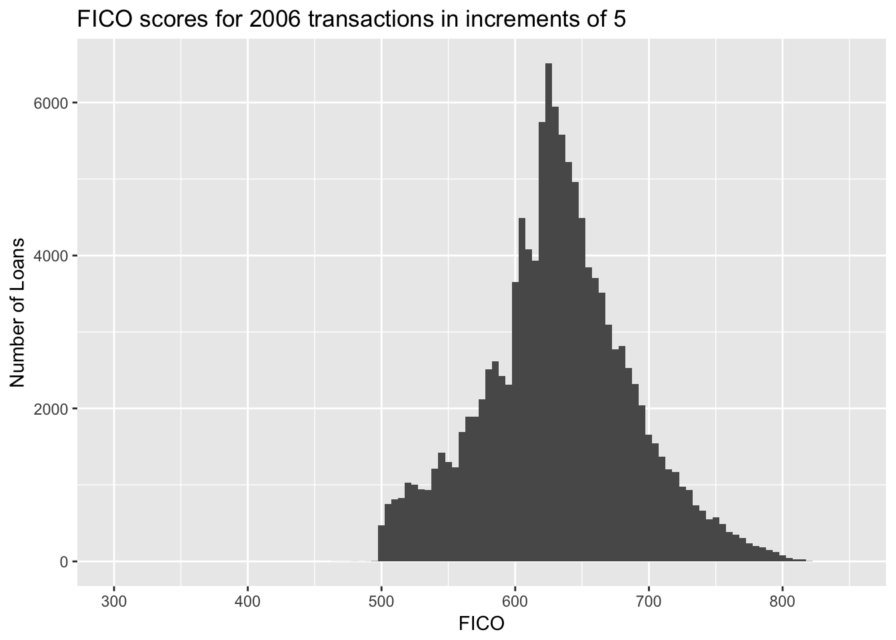

### FICO scores in the 2006 loan pool

FICO scores have a minimum value of 300, and a maximum value of 850. The summary statistics are:

<table>
 <thead>
  <tr>
   <th style="text-align:right;"> Min. </th>
   <th style="text-align:right;"> 1st Qu. </th>
   <th style="text-align:right;"> Median </th>
   <th style="text-align:right;"> Mean </th>
   <th style="text-align:right;"> 3rd Qu. </th>
   <th style="text-align:right;"> Max. </th>
  </tr>
 </thead>
<tbody>
  <tr>
   <td style="text-align:right;"> 0 </td>
   <td style="text-align:right;"> 600 </td>
   <td style="text-align:right;"> 631 </td>
   <td style="text-align:right;"> 631.9481 </td>
   <td style="text-align:right;"> 665 </td>
   <td style="text-align:right;"> 821 </td>
  </tr>
</tbody>
</table>

and the mode is 620. The minimum score represents loans without FICO scores:

<table class="table table-striped" style="width: auto !important; margin-left: auto; margin-right: auto;">
<caption>(\#tab:unnamed-chunk-32)Number of no-FICO loans by deal</caption>
 <thead>
  <tr>
   <th style="text-align:left;"> deal </th>
   <th style="text-align:right;"> fico </th>
  </tr>
 </thead>
<tbody>
  <tr>
   <td style="text-align:left;"> LBMLT 2006-4 </td>
   <td style="text-align:right;"> 0 </td>
  </tr>
  <tr>
   <td style="text-align:left;"> LBMLT 2006-WL2 </td>
   <td style="text-align:right;"> 0 </td>
  </tr>
</tbody>
</table>

Sixteen other loans had scores below 500:

<table class="table table-striped" style="width: auto !important; margin-left: auto; margin-right: auto;">
<caption>(\#tab:unnamed-chunk-33)Number of low-FICO loans by deal</caption>
 <thead>
  <tr>
   <th style="text-align:left;"> deal </th>
   <th style="text-align:right;"> fico </th>
  </tr>
 </thead>
<tbody>
  <tr>
   <td style="text-align:left;"> LBMLT 2006-1 </td>
   <td style="text-align:right;"> 498 </td>
  </tr>
  <tr>
   <td style="text-align:left;"> LBMLT 2006-2 </td>
   <td style="text-align:right;"> 491 </td>
  </tr>
  <tr>
   <td style="text-align:left;"> LBMLT 2006-2 </td>
   <td style="text-align:right;"> 492 </td>
  </tr>
  <tr>
   <td style="text-align:left;"> LBMLT 2006-2 </td>
   <td style="text-align:right;"> 470 </td>
  </tr>
  <tr>
   <td style="text-align:left;"> LBMLT 2006-2 </td>
   <td style="text-align:right;"> 487 </td>
  </tr>
  <tr>
   <td style="text-align:left;"> LBMLT 2006-2 </td>
   <td style="text-align:right;"> 465 </td>
  </tr>
  <tr>
   <td style="text-align:left;"> LBMLT 2006-2 </td>
   <td style="text-align:right;"> 481 </td>
  </tr>
  <tr>
   <td style="text-align:left;"> LBMLT 2006-2 </td>
   <td style="text-align:right;"> 493 </td>
  </tr>
  <tr>
   <td style="text-align:left;"> LBMLT 2006-WL1 </td>
   <td style="text-align:right;"> 497 </td>
  </tr>
  <tr>
   <td style="text-align:left;"> LBMLT 2006-WL1 </td>
   <td style="text-align:right;"> 497 </td>
  </tr>
  <tr>
   <td style="text-align:left;"> LBMLT 2006-WL1 </td>
   <td style="text-align:right;"> 482 </td>
  </tr>
  <tr>
   <td style="text-align:left;"> LBMLT 2006-WL1 </td>
   <td style="text-align:right;"> 498 </td>
  </tr>
  <tr>
   <td style="text-align:left;"> LBMLT 2006-WL1 </td>
   <td style="text-align:right;"> 494 </td>
  </tr>
  <tr>
   <td style="text-align:left;"> LBMLT 2006-WL1 </td>
   <td style="text-align:right;"> 473 </td>
  </tr>
  <tr>
   <td style="text-align:left;"> LBMLT 2006-WL1 </td>
   <td style="text-align:right;"> 496 </td>
  </tr>
  <tr>
   <td style="text-align:left;"> LBMLT 2006-WL3 </td>
   <td style="text-align:right;"> 498 </td>
  </tr>
</tbody>
</table>

The *cliffs* around 500 (below which only the small number of loans in the tables above are included), 600, 630 and 635 represent the cumulative segmentation of the pools to obtain favorable ratings. Not all deals followed this approach, however.

The variability among transactions suggest that *if* FICO scores have an influence on default rates, it may be necessary to stratify of otherwise transform the data to obtain useful results.

### The FICO scores are not normally distributed

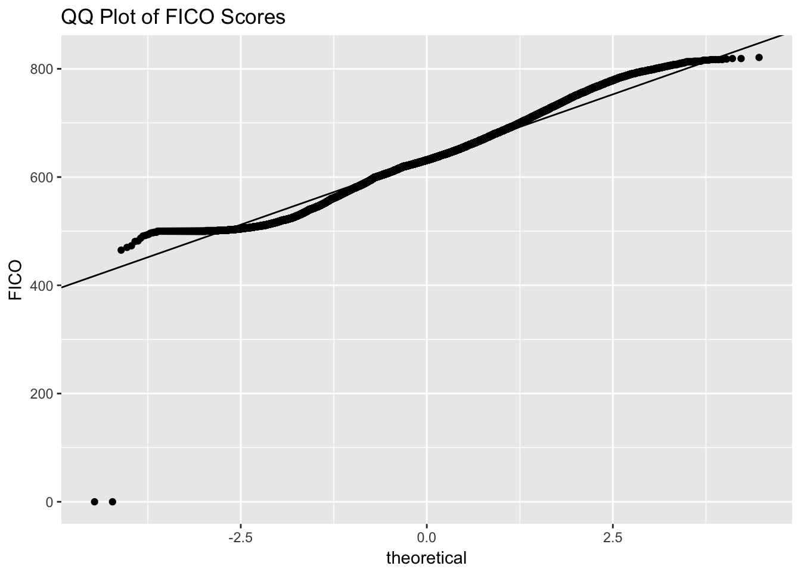

As a group, FICO scores have *fat tails,* a trait that is present in each of the deals to some degree. There are more loans with very low FICO scores than you would expect if score were randomly distributed plus more loans with high score. We also see a dip in the 500-600 range (loans that may only have been originated due to compensating factors), which are fewer than the sub-500 FICO loans.

With variations, all the deals have similiar distributions. The variability of FICO scores makes their use as an independent variable in, say, regression analysis potentially problematic.

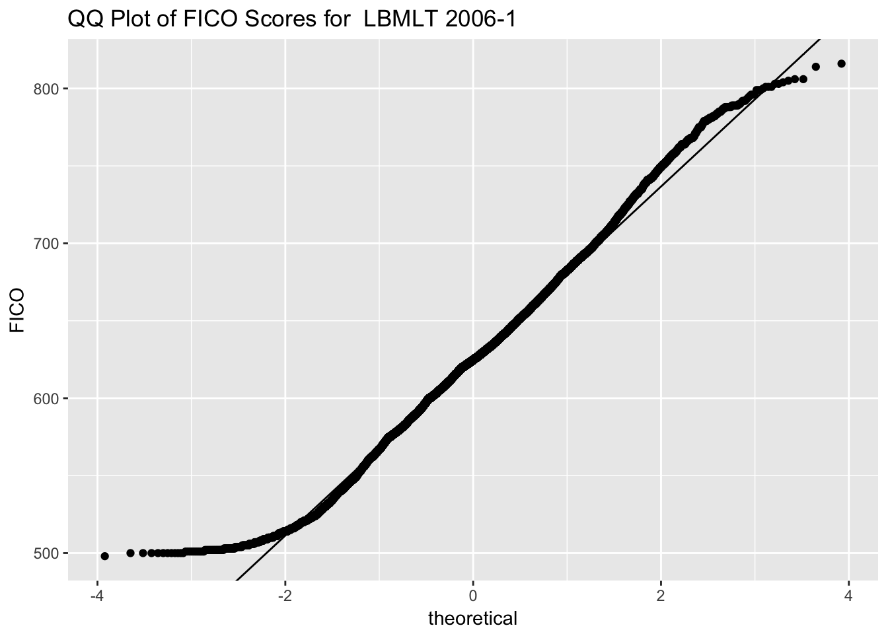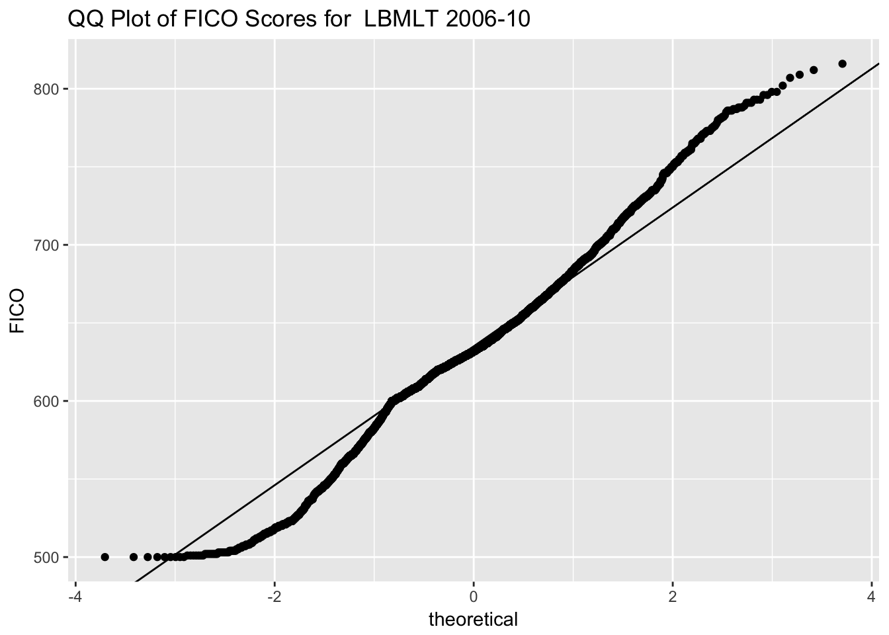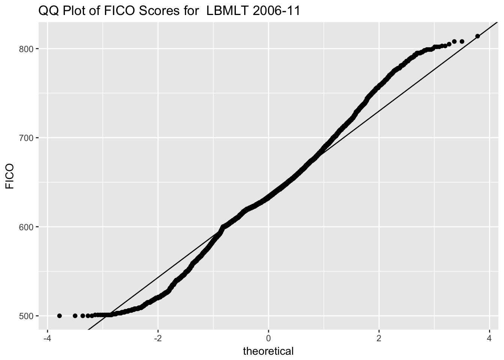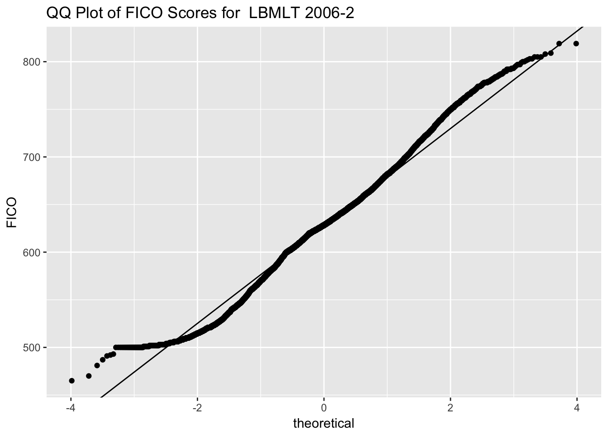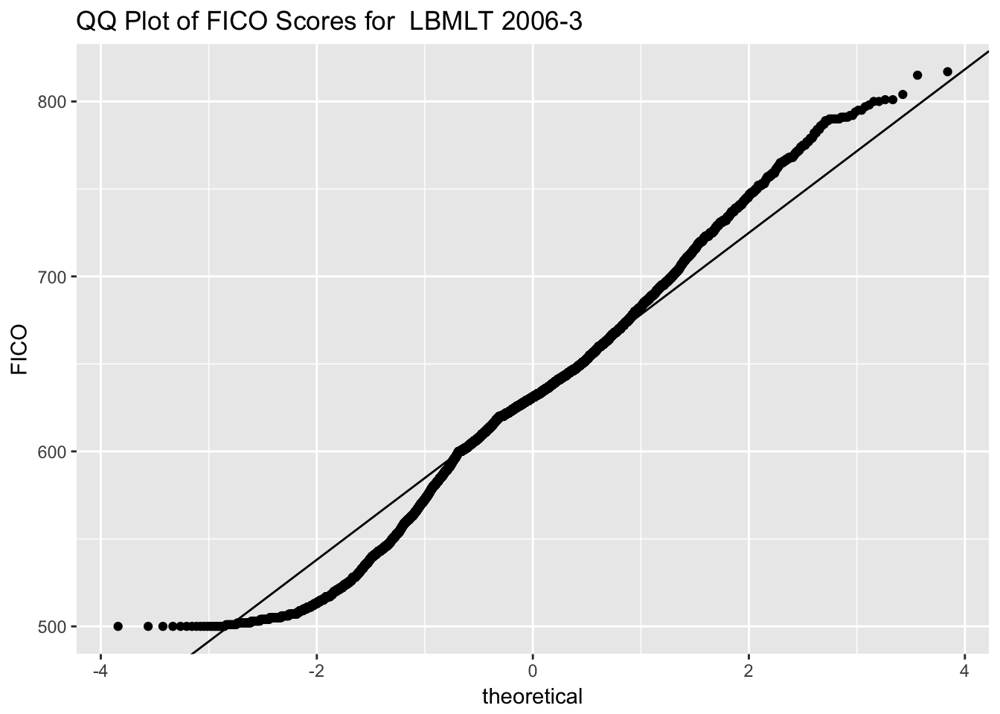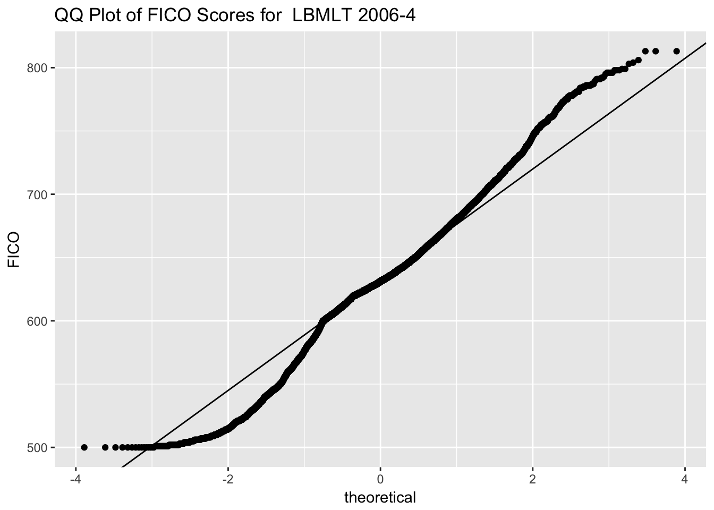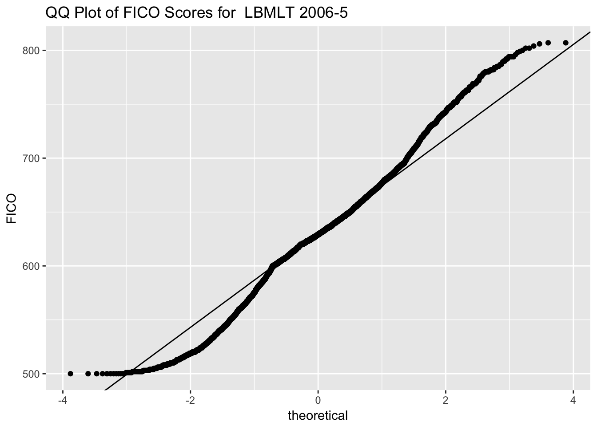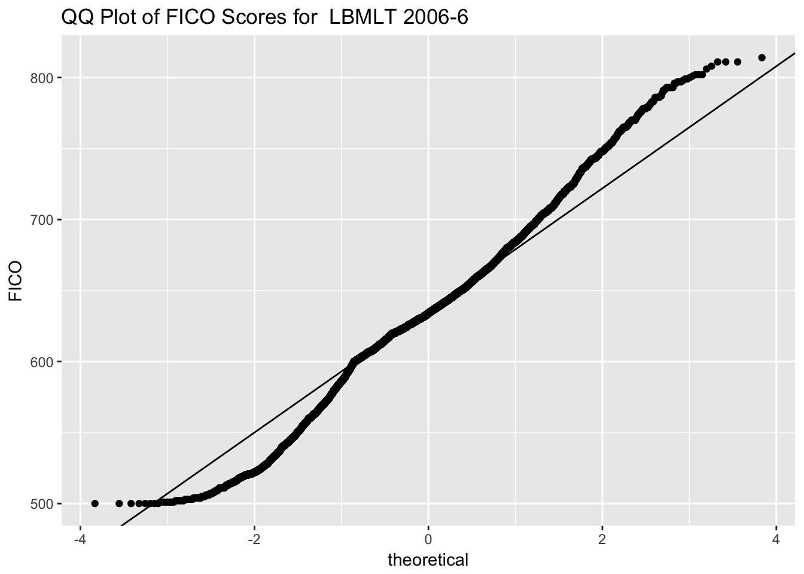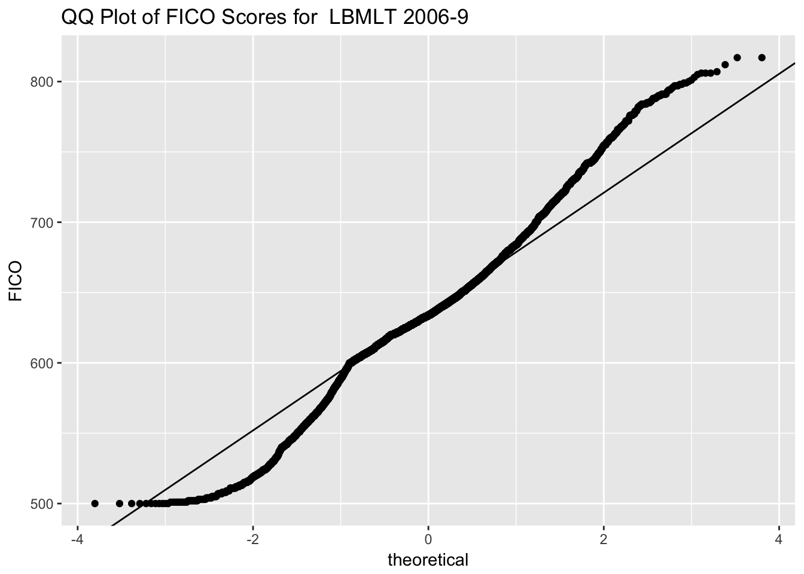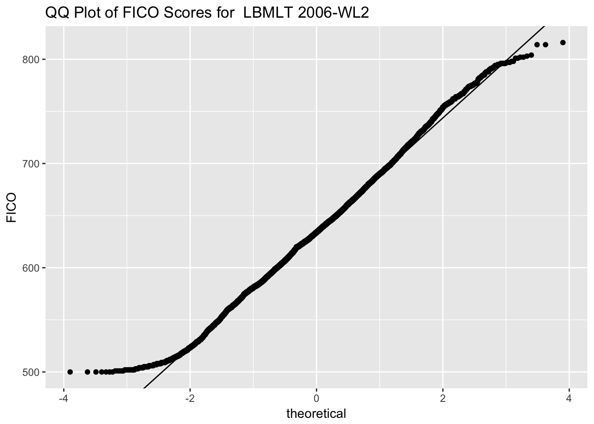

### Possible strategies to deal with the issues

Sampling the pool with a reasonably large number of observations will provide a well-behaved normal distribution, courtesy of the Central Limit Theorem. Alternatively, we can cluster based on the distance of each point from the trendline.

#### Possible complication

Between the time each deal was issued and the time that delinquency history was collated, almost a quarter of the loans dropped out:

    MariaDB [dlf]> select count(*) from y6 where ctapeno not in (select ytemp.ctapeno from ytemp )

    +----------+
    | count(*) |
    +----------+
    |    28908 |
    +----------+

whether due to prepayment in full, repurchase by the seller for breach or default, foreclosure and sale.

The dropped loans appear similar to the original pool.

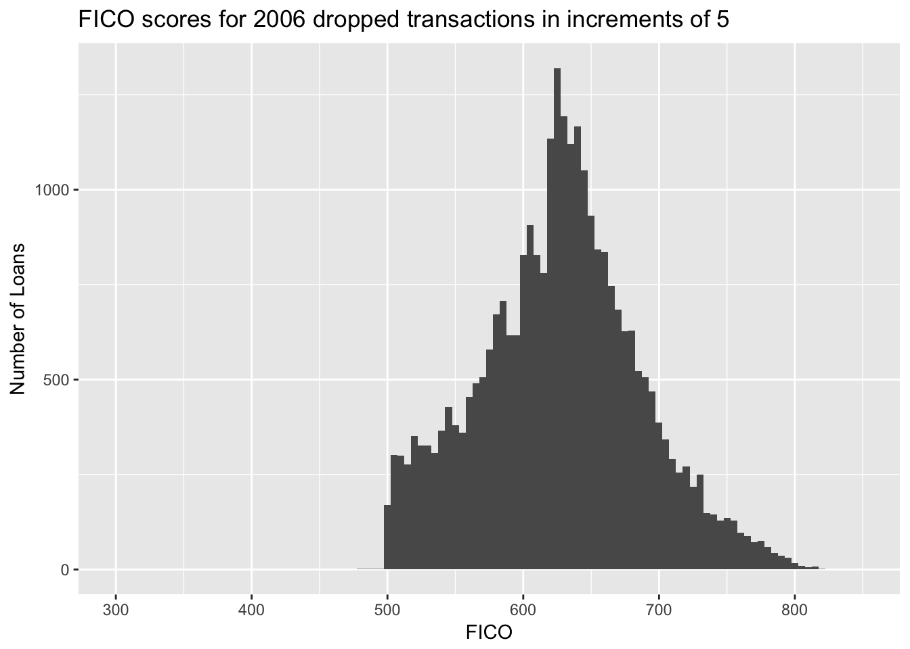

Summary statistics are similar.

<table>
 <thead>
  <tr>
   <th style="text-align:right;"> Min. </th>
   <th style="text-align:right;"> 1st Qu. </th>
   <th style="text-align:right;"> Median </th>
   <th style="text-align:right;"> Mean </th>
   <th style="text-align:right;"> 3rd Qu. </th>
   <th style="text-align:right;"> Max. </th>
  </tr>
 </thead>
<tbody>
  <tr>
   <td style="text-align:right;"> 482 </td>
   <td style="text-align:right;"> 587 </td>
   <td style="text-align:right;"> 628 </td>
   <td style="text-align:right;"> 626.7383 </td>
   <td style="text-align:right;"> 664 </td>
   <td style="text-align:right;"> 818 </td>
  </tr>
</tbody>
</table>

and the mode, 620, is identical. 

Like the total pool, the dropouts were not normally distributed. Since none of the drops were no-FICO loans, the slopes differ, but the shape of the distribution appears to be remarkably similar to the total pool.

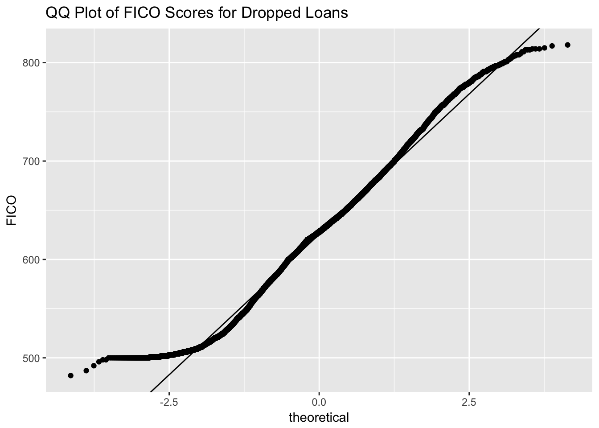

The distribution reports on each deal provide the cumulative number of defaulted loans that were liquidated. These were collected manually because there were only 15 files and I anticipated no future need to examine the reports.

<table class="table table-striped" style="width: auto !important; margin-left: auto; margin-right: auto;">
<caption>(\#tab:unnamed-chunk-40)Number of Liquidated Defaulted Loans Reported by the end of 2006</caption>
 <thead>
  <tr>
   <th style="text-align:left;"> deal </th>
   <th style="text-align:right;"> CIK </th>
   <th style="text-align:right;"> liquidated </th>
   <th style="text-align:left;"> reported </th>
  </tr>
 </thead>
<tbody>
  <tr>
   <td style="text-align:left;"> LBMLT 2006-1 </td>
   <td style="text-align:right;"> 1,350,315 </td>
   <td style="text-align:right;"> 6 </td>
   <td style="text-align:left;"> TRUE </td>
  </tr>
  <tr>
   <td style="text-align:left;"> LBMLT 2006-2 </td>
   <td style="text-align:right;"> 1,350,317 </td>
   <td style="text-align:right;"> 12 </td>
   <td style="text-align:left;"> TRUE </td>
  </tr>
  <tr>
   <td style="text-align:left;"> LBMLT 2006-3 </td>
   <td style="text-align:right;"> 1,355,515 </td>
   <td style="text-align:right;"> 3 </td>
   <td style="text-align:left;"> TRUE </td>
  </tr>
  <tr>
   <td style="text-align:left;"> LBMLT 2006-4 </td>
   <td style="text-align:right;"> 1,358,910 </td>
   <td style="text-align:right;"> 2 </td>
   <td style="text-align:left;"> TRUE </td>
  </tr>
  <tr>
   <td style="text-align:left;"> LBMLT 2006-5 </td>
   <td style="text-align:right;"> 1,364,477 </td>
   <td style="text-align:right;"> 0 </td>
   <td style="text-align:left;"> TRUE </td>
  </tr>
  <tr>
   <td style="text-align:left;"> LBMLT 2006-6 </td>
   <td style="text-align:right;"> 1,367,733 </td>
   <td style="text-align:right;"> 0 </td>
   <td style="text-align:left;"> TRUE </td>
  </tr>
  <tr>
   <td style="text-align:left;"> LBMLT 2006-7 </td>
   <td style="text-align:right;"> 1,370,358 </td>
   <td style="text-align:right;"> 0 </td>
   <td style="text-align:left;"> TRUE </td>
  </tr>
  <tr>
   <td style="text-align:left;"> LBMLT 2006-8 </td>
   <td style="text-align:right;"> 1,374,621 </td>
   <td style="text-align:right;"> 0 </td>
   <td style="text-align:left;"> TRUE </td>
  </tr>
  <tr>
   <td style="text-align:left;"> LBMLT 2006-9 </td>
   <td style="text-align:right;"> 1,374,622 </td>
   <td style="text-align:right;"> 0 </td>
   <td style="text-align:left;"> TRUE </td>
  </tr>
  <tr>
   <td style="text-align:left;"> LBMLT 2006-10 </td>
   <td style="text-align:right;"> 1,379,746 </td>
   <td style="text-align:right;"> 0 </td>
   <td style="text-align:left;"> FALSE </td>
  </tr>
  <tr>
   <td style="text-align:left;"> LBMLT 2006-11 </td>
   <td style="text-align:right;"> 1,382,996 </td>
   <td style="text-align:right;"> 0 </td>
   <td style="text-align:left;"> FALSE </td>
  </tr>
  <tr>
   <td style="text-align:left;"> LBMLT 2006-WL1 </td>
   <td style="text-align:right;"> 1,348,572 </td>
   <td style="text-align:right;"> 17 </td>
   <td style="text-align:left;"> TRUE </td>
  </tr>
  <tr>
   <td style="text-align:left;"> LBMLT 2006-WL2 </td>
   <td style="text-align:right;"> 1,350,316 </td>
   <td style="text-align:right;"> 22 </td>
   <td style="text-align:left;"> TRUE </td>
  </tr>
  <tr>
   <td style="text-align:left;"> LBMLT 2006-WL3 </td>
   <td style="text-align:right;"> 1,350,318 </td>
   <td style="text-align:right;"> 19 </td>
   <td style="text-align:left;"> TRUE </td>
  </tr>
</tbody>
</table>

(The field "CIK" represents the EDGAR lookup key on the SEC data base; the field "reported" is whether a report was required to filed by the end of 2006.)

#### Decision to focus on loan population still outstanding in early 2007

Only 81 loans of the 28908, or 0.28% of the dropped loans had defaulted and been liquidated by the end of 2006 reporting. On this basis, I decided to limit analysis to the remaining loans because FICO information about the dropped loans did not appear promising as a predictive factor in loan delinquency for the remaining loans.

### Reduced data set

#### Description

When the problem landed on my desk in early 2007, I had access to the delinquency history of the pool of loans remaining, 

As a result, I turn to the survivors in a similar data base:

    MariaDB [dlf]> describe y7;
    +----------+---------------+------+-----+---------+-------+
    | Field    | Type          | Null | Key | Default | Extra |
    +----------+---------------+------+-----+---------+-------+
    | city     | varchar(25)   | YES  |     | NULL    |       |
    | cltv     | decimal(10,0) | YES  |     | NULL    |       |
    | ctapeno  | decimal(10,0) | YES  |     | NULL    |       |
    | deal     | varchar(25)   | YES  |     | NULL    |       |
    | down     | int(11)       | YES  |     | NULL    |       |
    | dti      | decimal(10,0) | YES  |     | NULL    |       |
    | dtype    | varchar(25)   | YES  |     | NULL    |       |
    | ebal     | decimal(10,0) | YES  |     | NULL    |       |
    | fico     | decimal(10,0) | YES  |     | NULL    |       |
    | fpd      | date          | YES  |     | NULL    |       |
    | gainloss | decimal(10,0) | YES  |     | NULL    |       |
    | grade    | varchar(5)    | YES  |     | NULL    |       |
    | irate    | decimal(10,0) | YES  |     | NULL    |       |
    | issuer   | varchar(10)   | YES  |     | NULL    |       |
    | lat      | decimal(10,0) | YES  |     | NULL    |       |
    | lien     | int(11)       | YES  |     | NULL    |       |
    | liq      | decimal(10,0) | YES  |     | NULL    |       |
    | lng      | decimal(10,0) | YES  |     | NULL    |       |
    | lstatus  | int(11)       | YES  |     | NULL    |       |
    | ltype    | varchar(25)   | YES  |     | NULL    |       |
    | margin   | decimal(10,0) | YES  |     | NULL    |       |
    | metro    | varchar(25)   | YES  |     | NULL    |       |
    | nrate    | decimal(10,0) | YES  |     | NULL    |       |
    | obal     | decimal(10,0) | YES  |     | NULL    |       |
    | odate    | date          | YES  |     | NULL    |       |
    | oltv     | decimal(10,0) | YES  |     | NULL    |       |
    | orate    | decimal(10,0) | YES  |     | NULL    |       |
    | oterm    | int(11)       | YES  |     | NULL    |       |
    | payments | int(11)       | YES  |     | NULL    |       |
    | pmiflag  | int(11)       | YES  |     | NULL    |       |
    | pocode   | int(11)       | YES  |     | NULL    |       |
    | pod      | date          | YES  |     | NULL    |       |
    | ppp      | int(11)       | YES  |     | NULL    |       |
    | ptd      | date          | YES  |     | NULL    |       |
    | purpose  | varchar(25)   | YES  |     | NULL    |       |
    | remit    | decimal(10,0) | YES  |     | NULL    |       |
    | sbal     | decimal(10,0) | YES  |     | NULL    |       |
    | servno   | decimal(10,0) | YES  |     | NULL    |       |
    | sint     | decimal(10,0) | YES  |     | NULL    |       |
    | sprin    | decimal(10,0) | YES  |     | NULL    |       |
    | spymt    | decimal(10,0) | YES  |     | NULL    |       |
    | st       | varchar(4)    | YES  |     | NULL    |       |
    | zip      | int(11)       | YES  |     | NULL    |       |
    | otype    | varchar(25)   | YES  |     | NULL    |       |
    | rdate    | date          | YES  |     | NULL    |       |
    | ptype    | varchar(15)   | YES  |     | NULL    |       |
    | dptd     | int(7)        | YES  |     | NULL    |       |
    | dfpd     | int(7)        | YES  |     | NULL    |       |
    +----------+---------------+------+-----+---------+-------+
    48 rows in set (0.00 sec)
    
Some new fields will be important. As of the end of the first quarter 2007 *down* is the number of months that a loan has been delinquent. A value of down greater than 3 generally indicates a loan in foreclosure or a loan that has been foreclosed and is in the process of being sold.

The field *remit* is the past-month payment history encoded as a base10 number. The remittance reports contain a character field in the form "D110011011110" that shows whether a payment has been made ('0') or missed ('1') during the life of the loan. A little utility program converts the field to the equivalent binary number that captures that information.

     # convert a decimal (decimal, base 10) integer to a binary string (base 2)

    def dec2bin(n):
        '''convert decimal integer n to binary string bStr'''
        bStr = ''
        if n < 0:  raise ValueError("must be a positive integer")
        if n == 0: return '0'
        while n > 0:
            bStr = str(n % 2) + bStr
            n = n >> 1
        return bStr

    def int2bin(n, count=24):
        """returns the binary of integer n, using count number of digits"""
        return "".join([str((n >> y) & 1) for y in range(count-1, -1, -1)])

So, for example, if the remit field contains a value of 4198, the binary string representation, '1000001100110', can be interpreted as follows: missed the payment 12 months before, made five payments, missed two, made two, missed two, made one."

#### Creating a performance outcome measure

This provides a large menu of choices as to how to define *performance.* For example, if *remit = 0*, a loan has missed no payments in the preceding 12 months.

Unfortunately, there were few of those in the 2007 pool (the loans in securitizations issued in 2006 that remained in the pool at the end of the first quarter 2007, we will now call **the pool** and any subsets will be drawn from it), only 729 loans with perfect payment records.

A bigger problem is the large number of possible payment patterns over a 12-month period. It's the permutation of two objects (pay/no pay) taken 12 times with replacement. This means that there are potentially 4096 different possibilities.

We *could* treat delinquencies as a continuous variable, but that creates useless distinctions. Some domain specific knowledge will help sort things out.

1. *First payment delinquencies* in which the borrower fails to make the first payment due on a loan generally require the seller to repurchase the loan.
2. *Single payment delinquencies* in which the borrower has missed a payment (after making the first payment due) but made it in the following month (called the *one time thirty test*) are not considered serious, if not repeated.
3. *Two payment delinquencies* in which the as missed two payments (after making the first payment due) but made whether or not the payments were made in the third month (called the *two times thirty test*) are considered serious that it is customary for the seller to warrant that at the time of sale no such event has occurred.
4. *Three payment delinquencies* are referred to as *defaults,* whether or not the borrower subsequently cures. As a rule, loans with a history of default that has been cured can be sold only at a discount.
5. *Uncured defaults* are considered the most serious. Even if the payments missed are the three most recent and the borrower *may* repay in the following month, such a loan is classified as *nonperforming.*
6. *Loans in foreclosure* or *REO* (real estate owned, loans that have been foreclosed and awaiting sale) are also *nonperforming.*

This suggests a 3-factor performance metric:

* A: Performing: No more than two delinquencies in any reporting stratum
* B: Troubled: Three or more delinquencies a reporting stratum but current on most recent reporting date
* C: Non-performing: Uncured default on most recent reporting date

The problem is thus a *classification* problem. Do FICO scores allow us to classify loans? The first task is to assign each loan its appropriate metric.

#### Implementing the metric

From the 2007 pool database, we can pull the loan number, deal encoded remittance history and fico. With that we can decode the remittance history. Here's a sample with only loans having FICO scores below 500.

